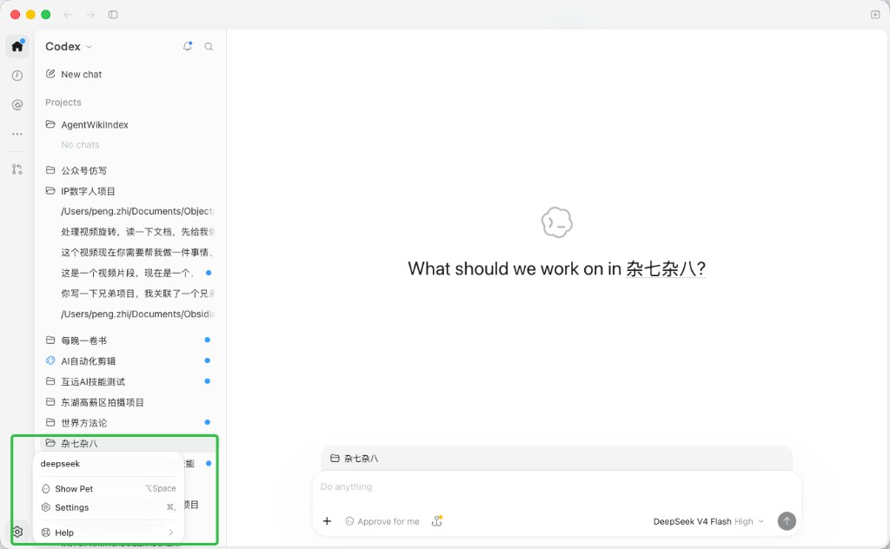
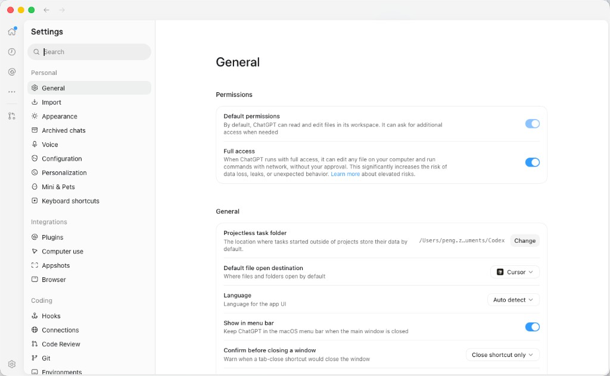
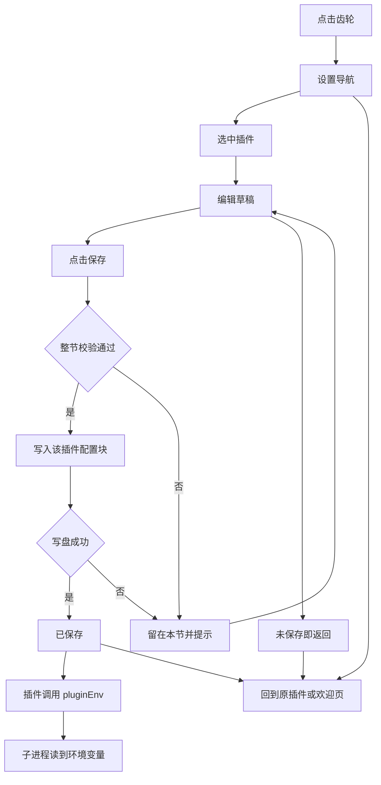
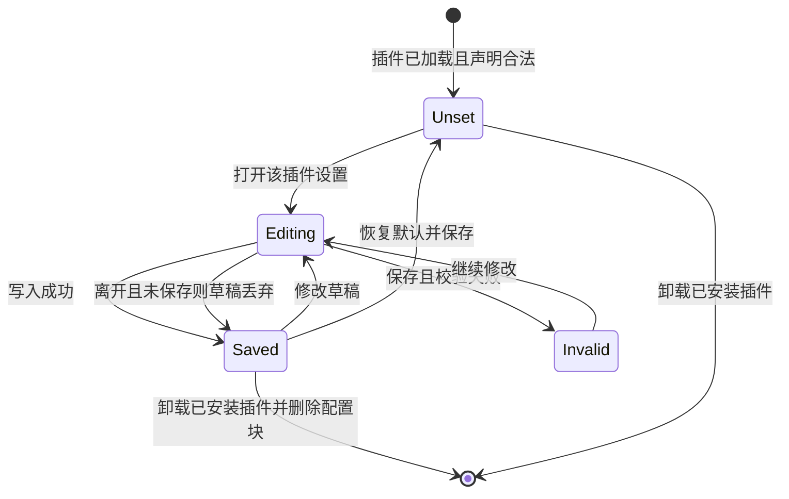

# PRD: 插件设置页

| 属性 | 值 |
|---|---|
| 状态 | 工程：accepted。见文末「工程验收状态」 |
| 范围 | Dex Buddy 工作台壳、插件 manifest 契约、用户数据目录中的配置存储 |
| 关联文档 | `docs/DESIGN.md`、`docs/plugin-development.md`、`docs/hub-plugin-architecture.md`、`README.md` |
| 界面参考 | `specs/prds/images/prd-00001-plugin-settings/` |
| 关联实现 | `src/renderer/index.html`、`src/renderer/app.js`、`src/renderer/style.css`、`src/main/types.ts`、`src/main/manifest.ts`、`src/main/install.ts` |

## 背景与问题

Dex Buddy 能扫描插件、打开插件页面、用 zip 安装和卸载。插件要密钥、引擎选项或重试次数时，今天只能把 `.env` 放进插件目录，或依赖宿主进程的环境变量。

这种方式在工作台里行不通：

1. 安装包不含密钥。同事或客户要自己找到解压目录，手改 `.env`。
2. 多个插件若都读同一份 `process.env`，同名变量会互相覆盖。
3. 格式写错时没有界面校验，调用直接失败。
4. 再次安装会换掉整个插件目录（`src/main/install.ts` 的 `replaceInstalledPlugin`）。写在插件目录里的 `.env` 会一起丢掉。

漫剧工作室、英语听力大师都是这类插件的例子。本 PRD 不改它们的代码，只规定工作台要提供的配置能力。插件作者在自己的仓库里接入。

## 目标与非目标

### 目标

- 侧栏底部有齿轮，进入与参考设置页同类的整页：左侧设置导航，右侧当前插件的配置。
- 插件在 `plugin.manifest.json` 的 `configSchema` 里声明字段。宿主按声明生成表单。
- 插件也可以提供 `settingsEntry` 自带设置页，与生成的表单读写同一块配置。
- 全部插件的配置写在用户数据目录的 `plugin-settings.json`，按插件 `id` 分块。重装保留，卸载已安装插件时删掉该块。
- 插件后端读取本插件配置，并在 `spawn` / `execFile` 时把这些值放进子进程环境变量。Python 继续用 `os.getenv`。

### 非目标

- 工作台自身的外观、语言、权限、快捷键。
- 设置同步、多配置档、团队下发。
- 导入 `.env`，或由宿主代写 `.env`。
- 系统钥匙串。密钥只在输入框遮挡，明文存在 `plugin-settings.json`。
- 劫持 `child_process`，或把配置写进宿主全局 `process.env`。
- Tailwind、Alpine，以及插件页用 `ipcRenderer` 直连主进程。
- 在线插件市场。
- 修改漫剧工作室、英语听力大师或任何外部插件的代码。
- 设置弹窗。入口是整页，不是对话框。

### 成功标准

- 声明了 `configSchema` 的插件能在设置页改完并保存，再次打开仍是保存后的值。
- 已安装插件重装后，该 `id` 在 `plugin-settings.json` 中的值与重装前一致。
- 卸载该已安装插件后，文件中不再有这个 `id`。
- `pluginEnv()` 的返回值包含本插件配置的字符串形式，且调用前后宿主 `process.env` 的对应键不变。
- `configSchema` 不合法时，插件仍然加载；设置区说明声明错误，不把错误声明注入子进程。

## 术语

| 术语 | 含义 |
|---|---|
| `configSchema` | manifest 里的配置声明。对象的键是环境变量名 |
| `settingsEntry` | 插件自带设置页，相对插件根目录 |
| 配置块 | `plugin-settings.json` 里某一个插件 `id` 对应的对象 |
| `getPluginConfig()` | 默认值与已保存值合并后的类型化配置，只含本插件已声明的键 |
| `pluginEnv()` | 给子进程用的环境变量对象：先复制宿主环境，再盖上本插件配置的字符串形式 |
| 密钥字段 | `type` 为 `string` 且 `secret: true` 的项 |

## 已拍板规则

| 项 | 决定 |
|---|---|
| 声明形状 | `configSchema` 对象。键名即环境变量名，不用设置项数组 |
| 键名 | 以大写字母开头，只含大写字母、数字、下划线，在该插件内唯一 |
| 字段类型 | `string`、`boolean`、`number`、`select`、`path` |
| 密钥 | 仅 `string` 可带 `secret: true`。密码框遮挡。保存后不回显明文。保存时密码框留空则保留原值。清除用单独的「清除」 |
| 选择项 | `select` 的 `options` 为非空字符串数组，`default` 必须是其中一项 |
| 路径 | `path` 的「更改」打开系统目录选择，结果先进入草稿。取消选择不改草稿。要填文件路径时用 `string` |
| 保存 | 每个插件一节一个「保存」。整节校验，有一项不合法则整节不写盘，草稿留在页面上 |
| 存储 | `userData/plugin-settings.json`，形状 `{ [pluginId]: { [envName]: value } }` |
| 读取 | 先铺 `default`，再用该插件已保存的值覆盖。只返回 schema 里声明过的键 |
| 损坏文件 | 按空配置启动，日志记一条错误，不打印文件内容 |
| 重装 | 不读写 `plugin-settings.json` |
| 卸载 | 仅 `source === installed` 的卸载删掉该 `id`。内置和开发路径不能从界面卸载，配置保留 |
| 隔离 | 插件只能读写自己的配置块。宿主设置页可以读取各插件声明，用于渲染 |
| 注入 | 插件显式传入 `env: ctx.pluginEnv()`。数字变成十进制字符串，布尔变成 `true` 或 `false`。未声明的键不进入该对象 |
| 声明错误 | 插件照常 `apply`。设置区提示错误。`getPluginConfig()` 对该插件返回空对象，`pluginEnv()` 不追加配置键 |
| 自带页面 | 有 `settingsEntry` 时用现有 webview 嵌在主区，隔离规则与插件界面相同。两者都有时，上面是生成的表单，下面是自带页面。只有自带页面、没有合法 schema 时，主区只显示自带页面；持久化键仍然必须来自合法 schema |
| 界面技术 | 工作台原生 HTML / CSS / JS。色值、按钮、圆角以 `docs/DESIGN.md` 为准。不增加图标轨 |

## 用户与角色

| 角色 | 目标 |
|---|---|
| 插件使用者 | 在设置页填写密钥和选项，不用找插件目录 |
| 插件开发者 | 在 manifest 声明字段，拉起脚本时拿到本插件的环境变量 |
| Dex Buddy 维护者 | 配置与插件目录分离，重装不丢、卸载不留已安装插件的配置 |

## 界面参考

信息架构对照下面两张图。色值、按钮和圆角仍以 `docs/DESIGN.md` 为准。图里的图标轨、宠物、帮助菜单，以及 General、Appearance 等工作台自身分类，不在本 PRD 范围。

入口。侧栏底部齿轮打开设置，对应图中菜单里的 Settings。



设置页。左侧是标题、搜索和分组导航，右侧是当前分节的标题和卡片。本 PRD 的分组只有「插件」。



| 文件 | 对照什么 |
|---|---|
| `specs/prds/images/prd-00001-plugin-settings/01-sidebar-settings-entry.png` | 齿轮放在侧栏底部，从这里进入设置 |
| `specs/prds/images/prd-00001-plugin-settings/02-settings-page.png` | 左导航加搜索，右栏为分节标题和卡片；开关、下拉、路径旁的「更改」 |

## 功能域

### 入口与导航

侧栏底部、安装按钮之下放置齿轮按钮。点击后侧栏从插件列表切换为设置导航，主区显示当前插件的配置。提供返回，回到进入设置之前的插件页或欢迎页。

设置导航包含标题「设置」、搜索框、分组「插件」。出现在列表中的插件至少满足一条：拥有合法 `configSchema`，或拥有合法 `settingsEntry`。两条都不满足的插件不出现。搜索只匹配插件显示名，以及设置项的标题和说明。没有匹配时，导航区说明没有结果。

### 表单

主区标题为插件显示名。每个声明字段一张卡片：标题、说明、控件。

| 类型 | 控件 |
|---|---|
| `boolean` | 开关 |
| `select` | 下拉 |
| `string` | 单行文本。`secret: true` 时为密码框 |
| `number` | 数字输入 |
| `path` | 当前草稿值，加「更改」 |

点「保存」后校验类型、`select` 是否落在选项内、数字是否为有限数。通过后写入该插件配置块，状态栏说明已保存。不通过时不写盘，指出哪一项不合法。

离开本节或返回插件列表时，未保存的草稿丢弃，已存储的值不变。

### 自带设置页

`settingsEntry` 的路径规则与 `uiEntry` 相同：插件目录内的相对路径，拒绝绝对路径和 `..`。页面跑在插件 webview 中，通过宿主桥读写本插件配置块，不能读取其他插件。宿主桥返回给页面的密钥字段与设置页一致，不回显已保存的明文。

### 宿主上下文

`ctx.getPluginConfig()` 与 `ctx.pluginEnv()` 绑定当前插件，不接受插件 `id` 参数。

插件拉起脚本时自行传入环境，例如 `execFile(binPath, args, { env: ctx.pluginEnv() })`。宿主不改写自己的 `process.env`。

### 与安装生命周期

安装、覆盖安装不迁移、不删除 `plugin-settings.json`。卸载已安装插件时，在插件目录删除成功之后移除对应配置块。卸载失败则配置块保留。

## 用户故事地图与版本切片

### 旅程主干

| 步骤 | 节点 | 说明 |
|---|---|---|
| 1 | Entry | 使用者在侧栏点击齿轮 |
| 2 | 导航 | 侧栏变为设置导航，列出有配置能力的插件 |
| 3 | 选择 | 打开某一个插件的分节 |
| 4 | 编辑 | 修改开关、下拉、文本、数字或目录 |
| 5 | 保存 | 校验通过后写入 `plugin-settings.json` |
| 6 | 使用 | 插件下次调用 `pluginEnv()` 时，子进程拿到新值 |
| 7 | 失败停留 | 校验失败或写盘失败时留在本节，草稿还在 |
| 8 | 放弃 | 未保存就返回，草稿丢弃 |
| 9 | Exit | 返回进入设置之前的插件页或欢迎页 |

### 故事地图

| 阶段 | 用户目标 | 用户故事 | 验收要点 |
|---|---|---|---|
| 发现 | 找到设置 | 作为使用者，我想从侧栏齿轮进入设置，以便不用打开插件目录 | 齿轮在侧栏底部；进入后侧栏是设置导航，主区是配置；返回后回到原先的插件或欢迎页 |
| 配置 | 改一项并保存 | 作为使用者，我想按字段填写并保存，以便插件使用我的选择 | 五类控件按 schema 渲染；保存后重新进入仍是新值；未保存就离开则磁盘上的值不变 |
| 配置 | 保护密钥 | 作为使用者，我想在界面上只看到遮挡的密钥，以便旁人看不到明文 | 密码框不回显已保存明文；留空保存不覆盖原密钥；「清除」之后该键为空字符串；日志不含密钥值 |
| 配置 | 知道填错了 | 作为使用者，我想在保存时看到哪一项不合法，以便改正后再写盘 | 有一项不合法则整节不写盘；草稿保留；状态说明指出字段 |
| 持续 | 升级插件 | 作为使用者，我想在重新安装后保留配置，以便不用再填密钥 | 覆盖安装前后，该 `id` 的配置块一致 |
| 持续 | 卸掉插件 | 作为使用者，我想卸载后不再留下该插件的配置，以便密钥不残留 | 卸载已安装插件成功后，JSON 中没有该 `id`；卸载失败时配置块仍在 |
| 开发 | 声明字段 | 作为插件开发者，我想在 manifest 里声明环境变量，以便宿主生成表单 | 合法 `configSchema` 能被解析；键名、类型、`select` 选项、`secret` 的放置符合已拍板规则 |
| 开发 | 注入子进程 | 作为插件开发者，我想把配置传给 Python 或 CLI，以便代码继续读环境变量 | `pluginEnv()` 只追加本插件已声明键的字符串值；宿主 `process.env` 不被修改；另一插件的键不在这个对象里 |
| 开发 | 自带页面 | 作为插件开发者，我想用自己的 HTML 补充设置，以便复杂说明不必挤进通用表单 | 合法 `settingsEntry` 嵌在主区；它与表单读写同一配置块；不能读到其他插件的配置 |
| 异常 | 声明写错 | 作为使用者，我想在插件声明错误时仍能打开插件，以便设置问题不挡住功能 | 插件仍加载；设置区说明声明错误；该插件的 `getPluginConfig()` 为空对象 |

### Release 0

可验收结果：

- 侧栏齿轮、设置导航、搜索、返回。
- `string`、`boolean`、`number`、`select`、`path` 的表单与整节保存。
- 密钥遮挡、留空保留、清除。
- `settingsEntry` 与生成表单共用配置块。
- `userData/plugin-settings.json` 的读写、损坏降级、重装保留、卸载已安装插件时删除配置块。
- `ctx.getPluginConfig()` 与 `ctx.pluginEnv()`。
- `docs/plugin-development.md` 写明 `configSchema`、`settingsEntry` 和 `pluginEnv()` 的接法。
- 测试覆盖：合法声明可解析；非法声明不导致插件加载失败且不注入；类型不合法不写盘；`pluginEnv()` 不改宿主环境且不含其他插件的键；卸载删除该 `id`；重装不删除配置文件。

### Release 1

同一 PRD 内的增强：每个字段提供「恢复默认」。恢复后该项草稿变为 `default`，仍需点「保存」才写入。没有默认值的字符串恢复为空字符串。

本期不做的能力已列在非目标，不另开更高版本。

## 核心流程与状态机图





声明不合法的插件不进入上图。它仍然加载，设置区停在错误说明，没有可保存的配置块写入。

## 数据与 API 衔接

manifest 扩展示例：

```json
{
  "id": "english-listening-master",
  "displayName": "英语听力大师",
  "version": "1.0.0",
  "type": "ui",
  "main": "index.js",
  "uiEntry": "ui/index.html",
  "settingsEntry": "ui/settings.html",
  "configSchema": {
    "OPENAI_API_KEY": {
      "type": "string",
      "title": "OpenAI API Key",
      "description": "用于生成文本的密钥",
      "default": "",
      "secret": true
    },
    "TTS_ENGINE": {
      "type": "select",
      "title": "语音合成引擎",
      "options": ["edge-tts", "azure-tts"],
      "default": "edge-tts"
    },
    "MAX_RETRY": {
      "type": "number",
      "title": "最大重试次数",
      "default": 3
    }
  }
}
```

`settingsEntry` 可省略。没有 `configSchema` 时不要写空对象占位；省略即表示没有声明式字段。

存储文件不放进插件 zip，也不放进仓库。值的类型与声明一致：字符串、布尔、有限数字。`select` 与 `path` 以字符串存储。

工作台壳通过现有宿主桥读取 schema 与配置块、提交保存。插件 webview 上的自带设置页使用同一套限制：普通结构化数据，无 Node。插件后端只通过绑定到自身的 `ctx` 方法读取，不接收任意插件 `id`。

实现时在 `src/main/manifest.ts` 校验声明，在主进程维护配置文件，在 `src/renderer/` 增加设置页。外观遵循 `docs/DESIGN.md`。

## 假设与待确认

| 项 | 处理 |
|---|---|
| 单用户桌面，配置文件只有一份 | 按此实现，不做多用户分档 |
| 外部插件自行改 `index.js` 去调用 `pluginEnv()` | 本仓只提供契约和文档，不改外部仓库 |
| `docs/plugin-development.md` 仍写着安装后手放 `.env` | Release 0 改这篇文档，改为设置页和 `pluginEnv()`，并说明 `.env` 不再是工作台里的配置方式 |

无未决产品分叉。

## 修订记录

| 日期 | 说明 |
|---|---|
| 2026-10-08 | 初稿。设置整页、`configSchema`、`plugin-settings.json`、`pluginEnv()`、自带设置页 |
| 2026-10-08 | 界面参考图放入 `specs/prds/images/prd-00001-plugin-settings/`，并写入文首与 PRD 索引 |

## 1. 工程验收状态

> 由 `/team:prd-accept` 维护；勿手工编造「通过」。最后更新：2026-10-08T10:47:36Z，main@5869170，范围：R0,R1。功能改动仍在该提交之上的工作区，尚未单独提交。

### 总览

- 工程状态：`accepted`
- 验收判定：Release 0 与 Release 1 范围内没有未实现项
- 最近验收：2026-10-08T10:47:36Z；维护者已在工作台确认设置页可用
- 代码提交：基线 `main@5869170`；本次实现尚未提交
- 摘要：侧栏进入设置整页；`configSchema` 生成五类表单并整节保存；密钥不回显；配置在 `userData/plugin-settings.json`，重装保留、卸载已安装插件后删除；`ctx.pluginEnv()` 不改宿主环境；每个字段可恢复默认且需再保存

### Release 交付

| Release | 状态 | 说明 |
|---|---|---|
| R0 | 通过 | 设置页、存储、注入、文档与规定测试均有实现 |
| R1 | 通过 | 每项「恢复默认」只改草稿，保存后才写盘 |

### 功能验收清单（Agent 优先读此表）

| ID | 能力摘要 | Release | 状态 | 证据 |
|---|---|---|---|---|
| R0-01 | 侧栏齿轮、设置导航、搜索、返回原先页面 | R0 | 通过 | `src/renderer/index.html` 的 `#settings-btn` / `#settings-nav`；`src/renderer/app.js` 的 `enterSettings`、`leaveSettings`、`onSettingsSearch` |
| R0-02 | string、boolean、number、select、path 表单与整节保存 | R0 | 通过 | `src/renderer/app.js` 的 `renderFieldControl`、`saveActiveSettings`；`src/main/plugin-settings.ts` 的 `normalizeDraft` |
| R0-03 | 密钥遮挡、留空保留、清除；日志不含密钥 | R0 | 通过 | `src/renderer/app.js` 的 `renderSecret`；`src/main/plugin-settings.ts` 的 `resolveSecret`；`test/plugin-settings.test.ts` |
| R0-04 | settingsEntry 与表单共用配置块，不能读其他插件 | R0 | 通过 | `src/preload/plugin.cjs` 的 `readSettings` / `saveSettings`；`src/main/index.ts` 的 `pluginIdFromSender`；`src/renderer/app.js` 的 `mountSettingsEntry` |
| R0-05 | plugin-settings.json 读写、损坏降级、重装保留、卸载已安装插件后删除 | R0 | 通过 | `src/main/plugin-settings.ts`；`src/main/install.ts` 在 `rmSync` 成功后调用 `deletePluginSettings`；`test/plugin-settings.test.ts` |
| R0-06 | getPluginConfig 与 pluginEnv，不改宿主环境，不含其他插件的键 | R0 | 通过 | `src/main/registry.ts` 的 `createContext`；`src/main/plugin-settings.ts` 的 `pluginEnv`；`test/plugin-settings.test.ts` |
| R0-07 | 文档写明 configSchema、settingsEntry、pluginEnv，并说明工作台不把 .env 当配置 | R0 | 通过 | `docs/plugin-development.md`；`README.md`；`docs/doc_index.md` |
| R0-08 | 规定测试：合法/非法声明、不写盘、pluginEnv、卸载删除、重装保留 | R0 | 通过 | `test/plugin-settings.test.ts`；`pnpm test` 25 项通过 |
| R1-01 | 每项恢复默认只改草稿，无默认的字符串变为空字符串，仍需保存 | R1 | 通过 | `src/renderer/app.js` 的 `restoreFieldDefault`、`appendReset` |

### 未完成与遗留

无。非目标（工作台自身设置、同步、钥匙串、代写 `.env`、在线市场）未纳入本次范围。

### 质量检查

| 检查项 | 状态 |
|---|---|
| pnpm test | 通过（25） |
| 文档同步（README / docs/doc_index.md） | 通过 |

---
统计：通过 9 / 部分 0 / 未实现 0 / 范围外 0
