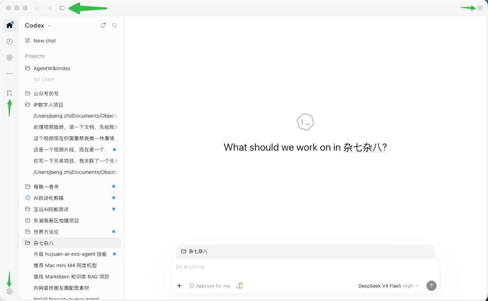
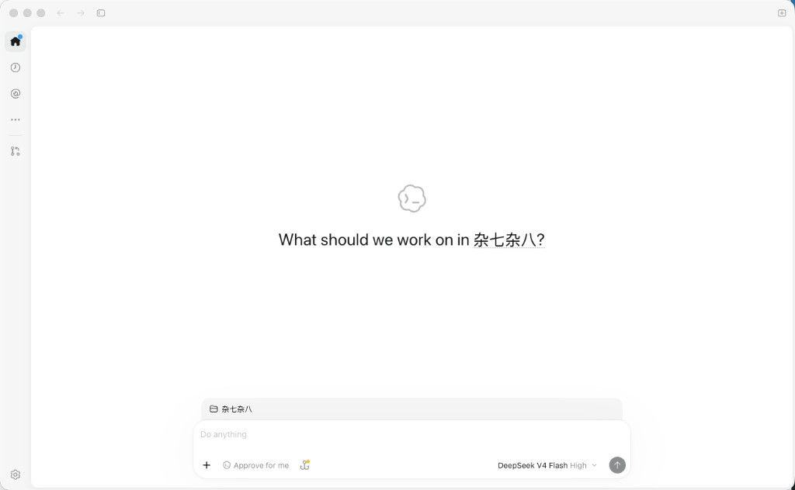
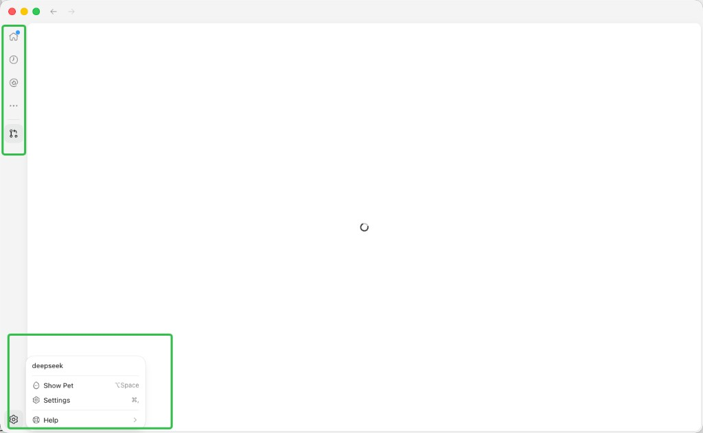
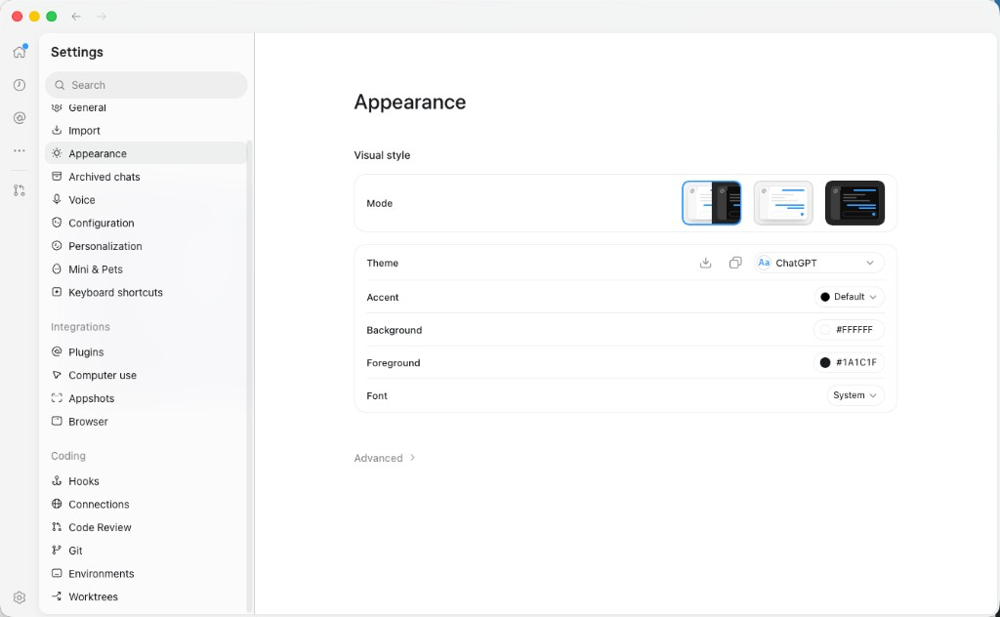
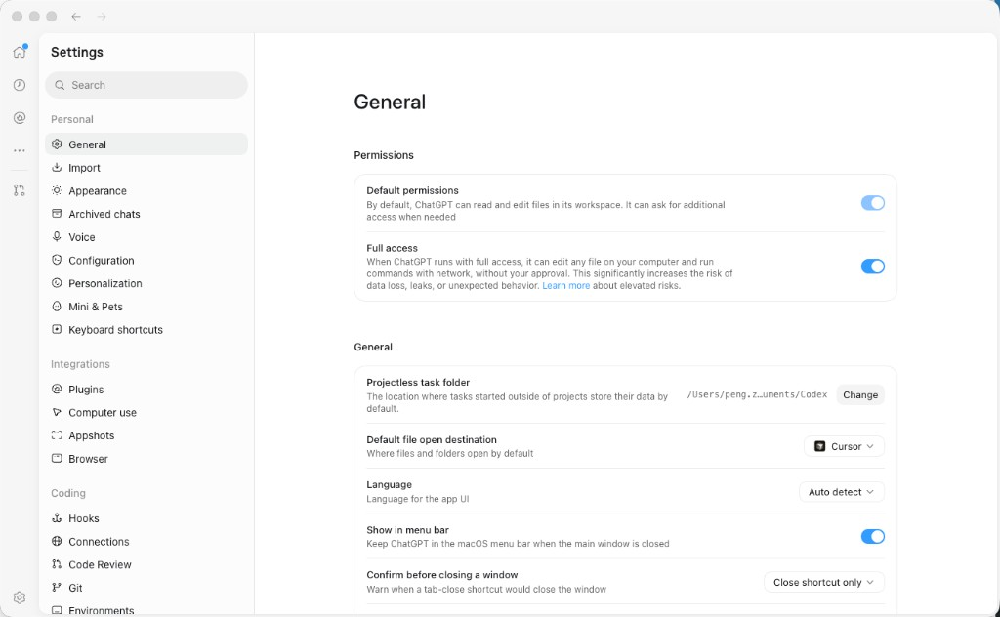
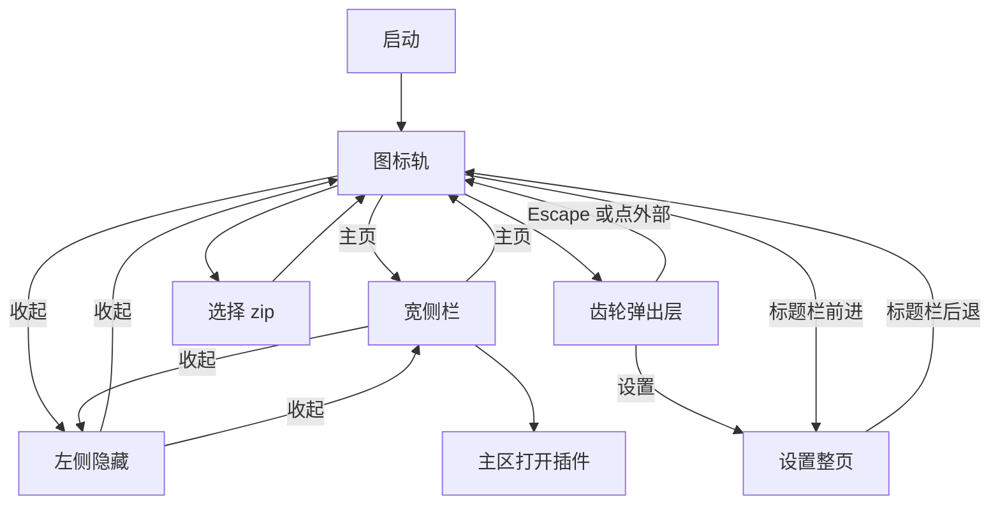
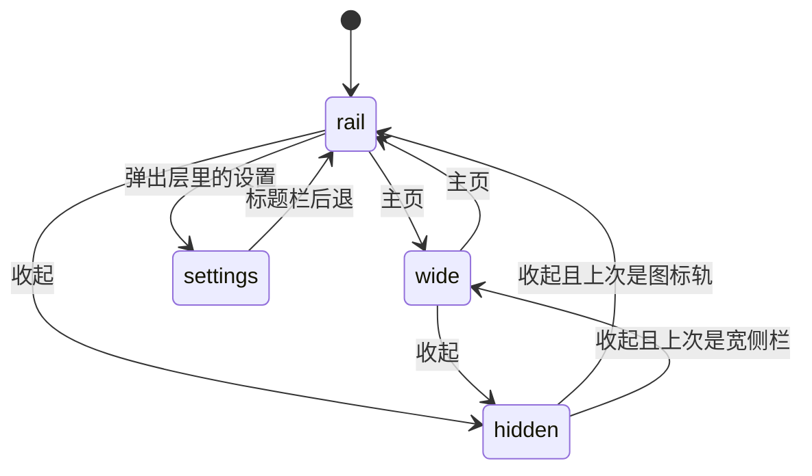
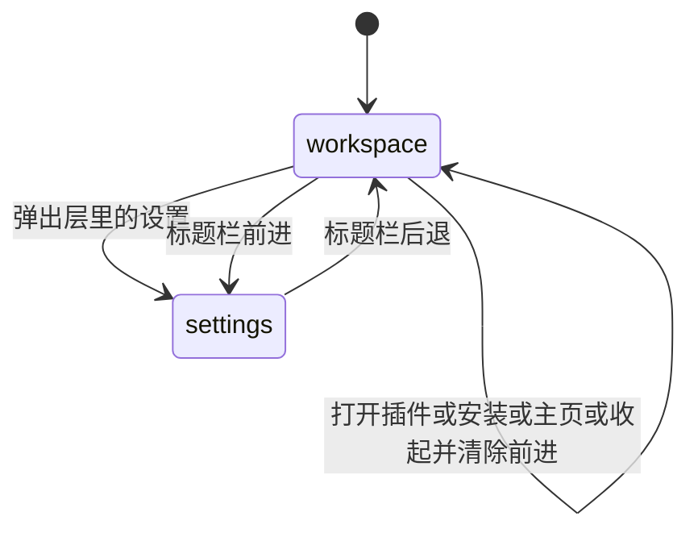

# PRD: 工作台壳图标轨与设置分栏

| 属性 | 值 |
|---|---|
| 状态 | 工程：partial。见文末「工程验收状态」 |
| 范围 | Dex Buddy 工作台壳的标题栏、左侧栏、设置页版式与壳图标 |
| 关联文档 | `docs/DESIGN.md`、`specs/prds/prd-00001-plugin-settings.md`、`README.md` |
| 界面参考 | `specs/prds/images/prd-00002-workbench-chrome/` |
| 关联实现 | `src/renderer/index.html`、`src/renderer/style.css`、`src/renderer/sidebar.js`、`src/renderer/plugins.js`、`src/renderer/settings.js`、`src/renderer/updater.js`、`src/renderer/app.js`、`src/preload/host.cjs`、`docs/DESIGN.md` |

## 背景与问题

工作台现在是一条宽侧栏：字标、插件列表、安装、设置和更新挤在同一列，主区打开插件。设置页的导航也塞在这条侧栏里，并自带「返回」。

对照 Codex 桌面壳之后，要改的是壳，不是插件契约：

1. 插件页面应占中间整块内嵌区。左侧默认收成一列图标，需要时再展开成现在的插件列表。
2. 后退、前进和收起侧栏放到窗口标题栏。设置页因此不再放自己的返回。
3. 设置页改成标题、搜索、可滚动左栏和可拖分隔，右栏仍是现有插件配置。
4. 壳上继续手写 SVG 会和这套线性图标脱节。图标改用现成的 Lucide。

`specs/prds/prd-00001-plugin-settings.md` 里的 `configSchema`、`plugin-settings.json`、`pluginEnv()` 和表单规则继续有效。本 PRD 只替换它的入口和页内返回：齿轮不再直接进入设置，设置导航里不再放「返回」。

## 目标与非目标

### 目标

- 启动后左侧是窄图标轨。点「主页」展开成现在的宽侧栏（字标 + 插件列表）。两者互斥，不同时出现。
- 标题栏有后退、前进、收起。收起后左侧整列消失，只留中间内嵌页。再点一次回到收起前的图标轨或宽侧栏。
- 安装、设置、更新只出现在图标轨。齿轮打开弹出层，里面有本机用户名、更新和「设置」。
- 设置是标题栏以下的左右分栏。左栏可滚动，分隔可拖，页面内没有返回。
- 壳图标全部来自 Lucide，尺寸 16、描边 1.5、颜色 `currentColor`。

### 非目标

- 三个点、分割线下方占位图标的菜单或动作。
- 参考图里的 Show Pet、Help、历史、提及、通用、外观、语音、权限、语言、快捷键。
- 在线账号、插件市场、插件页面内部的前进后退。
- 宽侧栏或完全收起时再放一颗更新蓝点。
- 手写壳图标 SVG，运行时从 CDN 拉图标，或为图标引入 React、打包步骤、第二套图标库。
- 把 Codex 的输入框、云朵图标或动作卡搬进工作台。
- 修改 `configSchema`、配置存储、更新下载与安装对话框的行为。

### 成功标准

- 冷启动左侧是图标轨，主区仍是欢迎页或此后打开的插件页。
- 主页在图标轨与宽侧栏之间切换。宽侧栏里没有安装、设置、更新。
- 收起后面板只剩中间内嵌页；再点收起，回到收起前的那一态。
- 有可安装更新时，只有图标轨上的齿轮出现蓝点。弹出层能打开现有更新对话框；检查失败时弹出层能重试。
- 设置页没有返回按钮。标题栏后退回到进入设置前的那个插件（或欢迎页），左侧回到图标轨。
- 设置左栏搜索和右栏表单与现在一致。分隔拖动后的宽度在下次进入设置时还在。
- 壳上可见图标都能在本文「图标」表里找到 Lucide 名称，没有新增手写 path。

## 术语

| 术语 | 含义 |
|---|---|
| 图标轨 | 左侧窄列，只放图标。模式名 `rail` |
| 宽侧栏 | 现在的字标加插件列表。模式名 `wide` |
| 收起 | 左侧整列不显示，主区拉满。模式名 `hidden` |
| 壳表面 | 标题栏后退/前进所记录的两层：工作区、设置 |
| 工作区 | 欢迎页、后台插件说明或插件内嵌页，加上当时的左侧模式 |
| 齿轮弹出层 | 点设置图标后在图标轨旁打开的菜单，不是设置页 |
| 蓝点 | 齿轮上的更新提示，颜色用 `--status` |

## 已拍板规则

| 项 | 决定 |
|---|---|
| 左侧三态 | `rail`、`wide`、`hidden` 互斥。图标轨和宽侧栏不并排 |
| 主页 | `rail` 与 `wide` 对切。`hidden` 时主页不可见，不负责把侧栏叫回来 |
| 收起按钮 | 从 `rail` 或 `wide` 进入 `hidden`，并记住来源。再点一次回到该来源。按钮始终留在标题栏 |
| 冷启动 | 每次打开都是 `rail`。不记忆上次是宽侧栏还是收起 |
| 宽侧栏内容 | 字标「Dex Buddy / 统一工作台」和插件列表。安装、设置、更新不放进这一列 |
| 宽侧栏宽度 | 沿用现有拖动：220–480px，默认 292px，键 `dex.sidebarWidth`。图标轨固定 48px，不可拖 |
| 安装 | 图标轨上的加号调用现有 `pickAndInstall()`。安装完留在图标轨，不自动展开宽侧栏。欢迎页拖放 zip 保持原样 |
| 占位图标 | `ellipsis` 与 `circle-user` 可见、可聚焦，点击无菜单、无提示、无导航。不用灰色禁用态 |
| 齿轮 | 只在图标轨。点击打开弹出层，不直接进入设置 |
| 弹出层 | 本机用户名、更新行、「设置」。点外部或按 Escape 关闭。没有 Show Pet、Help |
| 用户名 | 操作系统账户名，只读。读不到或为空时显示「本地用户」。无登录 |
| 蓝点 | 仅更新状态 `readyToInstall` 时出现在齿轮上。`error` 不显示蓝点，弹出层提供现有重试。`downloading` 及其他状态不显示蓝点，下载说明仍走现有状态栏 |
| 更新动作 | `readyToInstall` 时弹出层的更新行打开现有更新对话框，确认后仍走现有 `installUpdate()` |
| 设置入口 | 弹出层里的「设置」。进入后标题栏以下整页分栏，图标轨隐藏 |
| 设置版式 | 左栏标题「设置」、搜索、可滚动插件列表；右栏为现有表单或 `settingsEntry`。页面内无返回 |
| 设置分隔 | 可拖，范围 220–480px，默认 292px，键 `dex.settingsNavWidth`。左右方向键每次 16px，双击恢复 292px。与 `dex.sidebarWidth` 分开存储 |
| 设置搜索 | 继续匹配插件显示名，以及字段标题和说明。空文案保持「没有可配置的插件」「没有结果」 |
| 未保存草稿 | 离开设置时丢弃草稿，磁盘上的值不变。沿用现有 `leaveSettings()`，不增加确认框 |
| 壳历史 | 只记录工作区与设置。打开另一个插件、安装、切换主页、收起侧栏都不入栈。这些动作会清掉「前进」 |
| 后退 | 在设置中调用 `leaveSettings()`，主区回到进入前的插件或欢迎页，左侧回到 `rail` |
| 前进 | 仅当上一步是从设置后退时可用，再次进入设置 |
| 无历史 | 后退或前进没有目标时按钮禁用，点击无效果 |
| 设置中的收起 | 禁用。此时没有图标轨或宽侧栏可收 |
| 标题栏位置 | 后退、前进在标题栏左侧，macOS 上位于红绿灯右侧。收起在标题栏右侧。三个按钮不参与窗口拖拽 |
| 非 macOS | 同样绘制高 34px 的控制条来放这三个按钮。实现时回写 `docs/DESIGN.md` |
| 图标 | 只用 Lucide，见下文。`src/renderer/index.html` 里安装、齿轮、更新三处手写 SVG 换成同一套 |

## 冲突与决议

| 现有说法 | 决议 |
|---|---|
| `docs/DESIGN.md` 写明左右仍是侧栏加主区，不改成图标轨 | 本 PRD 覆盖这一句。实现时改成：默认图标轨；宽侧栏仍可拖；不引入会话栏、输入框或动作卡。色值、圆角、按钮、焦点环、禁止 React 与 emoji 图标仍然有效 |
| `prd-00001` 的齿轮在侧栏底部并直接进入设置，设置导航含返回 | 入口改为图标轨齿轮的弹出层；返回改为标题栏后退。配置契约不变 |

## 用户与角色

| 角色 | 目标 |
|---|---|
| 工作台使用者 | 用图标轨打开插件、安装 zip、看到更新并进入设置 |
| 插件开发者 | 设置页仍按 `configSchema` / `settingsEntry` 工作，不改插件仓库 |
| Dex Buddy 维护者 | 壳图标来自一个库，视觉规则仍落在 `docs/DESIGN.md` |

## 界面参考

信息架构对照下面五张图。图上的绿色箭头和绿框是标注，不是界面元素。色值、按钮和圆角仍以 `docs/DESIGN.md` 为准。本 PRD 不实现参考图里并排的图标轨与项目列表，也不实现其中的聊天、宠物、帮助和壳设置分组。

标题栏。后退与前进在左，收起在右。

收起之后。左侧整列消失，中间内嵌页拉满。收起按钮仍在标题栏，以便再打开。

图标轨与齿轮弹出层。本 PRD 的图标顺序是主页、安装、三个点、分割线、占位图标，齿轮钉在底部。弹出层只有用户名、更新和「设置」。

设置页。左栏是标题和搜索，中间分隔可拖，右栏是内容。本 PRD 的左栏列表仍是插件，右栏仍是现有配置表单。

右栏密度。卡片、开关和分组标题的疏密对照此图。内容仍是插件配置，不增加权限或语言。

| 文件 | 对照什么 |
|---|---|
| `specs/prds/images/prd-00002-workbench-chrome/01-titlebar-reference.png` | 后退、前进在标题栏左侧，收起在右侧 |
| `specs/prds/images/prd-00002-workbench-chrome/02-sidebar-collapsed.png` | `hidden`：没有左侧栏，主区拉满 |
| `specs/prds/images/prd-00002-workbench-chrome/03-icon-rail-popover.png` | 窄图标轨，齿轮弹出层从左下角打开 |
| `specs/prds/images/prd-00002-workbench-chrome/04-settings-layout.png` | 设置标题、搜索、可滚动左栏、可拖分隔 |
| `specs/prds/images/prd-00002-workbench-chrome/05-settings-content-density.png` | 右栏标题与卡片的疏密 |

## 图标

Codex 桌面壳没有公开图标源码。开源仓库 `openai/codex` 是命令行与 Rust，不是这些截图里的窗口，也没有给这套壳指定图标库。截图是约 16px 的线性描边，和 Lucide 同一类。该仓库里另有讨论把 `lucide:` 当作可引用的开源图标包。本 PRD 据此选用 Lucide，不把截图说成 Codex 官方绑定了这个库。

| 位置 | Lucide 名称 | 动作 |
|---|---|---|
| 标题栏后退 | `arrow-left` | 壳历史后退 |
| 标题栏前进 | `arrow-right` | 壳历史前进 |
| 标题栏收起，左侧可见时 | `panel-left-close` | 进入 `hidden` |
| 标题栏收起，左侧已隐藏时 | `panel-left-open` | 回到收起前的 `rail` 或 `wide` |
| 图标轨主页 | `house` | `rail` 与 `wide` 对切 |
| 图标轨安装 | `plus` | `pickAndInstall()` |
| 图标轨三个点 | `ellipsis` | 无 |
| 分割线下占位 | `circle-user` | 无 |
| 图标轨齿轮 | `settings` | 打开弹出层 |
| 弹出层更新行 | `download` | 打开现有更新对话框，或在失败时重试 |

实现约定：

- 依赖 npm 包 `lucide`（ISC）。实现时由人在仓库根执行 `pnpm add lucide`。不从 unpkg 或其他 CDN 加载。
- 渲染进程没有打包器，窗口 `sandbox` 为真，不能解析裸导入。使用本地包里的脚本，以 `data-lucide` 和 `createIcons` 只注册上表这些图标。
- 每个图标 `width="16"` `height="16"` `stroke-width="1.5"`，颜色 `currentColor`。Lucide 默认 24px、描边 2，必须在属性里改过来。
- 不用 `lucide-react`，不增加前端构建。

## 功能域

### 标题栏

macOS 继续使用现有 `#titlebar`：高 `--titlebar-height`，底色 `--titlebar`，红绿灯位置不变。后退与前进放在红绿灯右侧，收起放在标题栏右端。Windows 与 Linux 增加同样高度的一条控制条，只为放下这三个按钮。

无历史方向的按钮使用禁用态，焦点环仍在。设置页打开时，收起为禁用，后退可用。

### 图标轨

自上而下：主页、安装、三个点、1px `--line` 分割线、`circle-user`。齿轮钉在列的底部，与上面的图标分开。列宽 48px。悬停和焦点沿用导航项的浅灰圆角（8px，`--hover`），焦点环 2px `--focus`。

蓝点画在齿轮图标上，直径约 6px，颜色 `--status`，不做成按钮底色。

### 宽侧栏

展开后替换图标轨，而不是挤在图标轨右边。内容与现在的插件列表相同：字标、空状态「还没有可用插件」、名称、界面/后台、版本与来源。点某一项仍在主区打开该插件。主区的卸载按钮、欢迎页拖放区、后台插件说明保持不动。

宽侧栏与主区之间继续使用现有分隔热区。`rail` 与 `hidden` 不显示这条分隔。

### 齿轮弹出层

从齿轮向上展开，宽约 220px，白底、1px `--line`、圆角约 12px、阴影只用 `--shadow`。第一行是用户名，不可点。更新行按「已拍板规则」出现。最后一行「设置」进入设置页并关闭弹出层。

用户名由主进程读取 `os.userInfo().username`，经 `src/preload/host.cjs` 的宿主桥只读交给渲染进程。

### 设置页

打开设置时隐藏图标轨和宽侧栏，标题栏以下分成两列。左列独立滚动，右列独立滚动。左列是标题「设置」、搜索框、插件按钮列表。选中态仍是浅灰圆角条。右列沿用现在的字段卡片、保存、空状态和 `settingsEntry`。

分隔的键盘与双击行为与现有侧栏分隔相同，只是宽度存在另一个键。

### 壳历史

栈里最多两层：工作区，以及可选的设置。进入设置时压入设置。后退弹出设置并恢复工作区。此后前进可以再次进入设置。一旦使用者打开插件、安装、点主页或收起侧栏，前进目标清除。

插件 A 切到插件 B 不产生历史。标题栏后退不会从 B 回到 A。

## 用户故事地图与版本切片

### 旅程主干

| 步骤 | 节点 | 说明 |
|---|---|---|
| 1 | Entry | 打开工作台，左侧为图标轨，主区为欢迎页 |
| 2 | 展开 | 点主页，看到字标和插件列表 |
| 3 | 使用 | 点一个插件，主区打开它的内嵌页 |
| 4 | 收回 | 再点主页，回到图标轨，主区仍是该插件 |
| 5 | 设置 | 从齿轮弹出层进入设置，改完或未保存即离开 |
| 6 | Exit | 标题栏后退回到该插件，左侧为图标轨 |

收起侧栏是从第 2 步或第 4 步分出的支路：进入 `hidden` 后，同一按钮回到进入时的那一态，然后可以继续走到 Exit。

### 故事地图

| 阶段 | 用户目标 | 用户故事 | 验收要点 |
|---|---|---|---|
| 启动 | 看到图标轨 | 作为使用者，我想打开后先看到一列图标，以便主区留给插件 | 冷启动是 `rail`；主页、安装、三个点、分割线、占位图标、底部齿轮都在；没有宽侧栏 |
| 浏览 | 打开插件列表 | 作为使用者，我想点主页看到现在的插件列表，以便选一个插件 | `wide` 含字标和插件列表；不含安装、设置、更新；点插件后主区打开该插件 |
| 浏览 | 回到图标 | 作为使用者，我想再点主页收起列表，以便回到图标轨 | 回到 `rail`；主区插件保持打开 |
| 浏览 | 让出左侧 | 作为使用者，我想收起整个左侧，以便只看插件页 | 变为 `hidden`，与参考图 02 一致；再点收起回到刚才的 `rail` 或 `wide` |
| 安装 | 从图标安装 | 作为使用者，我想点加号安装 zip，以便不必先展开列表 | 仍调用 `pickAndInstall()`；成功后留在 `rail`；欢迎页拖放仍可用 |
| 占位 | 忽略未完成图标 | 作为使用者，我想看到三个点和底栏占位图标，以便以后再接功能 | 两枚图标可见；点击无菜单、无提示、无页面变化 |
| 更新 | 知道有新版本 | 作为使用者，我想在齿轮上看到蓝点，以便知道可以更新 | 仅 `readyToInstall` 显示蓝点；点开弹出层能看到版本并打开现有更新对话框 |
| 更新 | 检查失败后重试 | 作为使用者，我想在弹出层里重试，以便不用找别的入口 | 状态 `error` 时无蓝点；弹出层有重试，并调用现有 `retryUpdateCheck()` |
| 账号 | 看见本机名字 | 作为使用者，我想在弹出层里看到本机用户名，以便确认这是本机工作台 | 显示操作系统账户名；读不到时显示「本地用户」；没有登录框 |
| 设置 | 进入配置 | 作为使用者，我想从弹出层进入设置，以便修改插件配置 | 标题栏以下左右分栏；左栏标题为「设置」且有搜索；页面内没有返回 |
| 设置 | 找到插件 | 作为使用者，我想搜索并滚动左栏，以便插件多时仍能找到 | 搜索规则与现在相同；无匹配时显示「没有结果」；左栏独立滚动 |
| 设置 | 调整栏宽 | 作为使用者，我想拖动中间分隔，以便左栏够用 | 宽度限制 220–480；松手后写入 `dex.settingsNavWidth`；双击恢复 292 |
| 设置 | 离开不丢插件 | 作为使用者，我想用标题栏后退离开设置，以便回到刚才的插件 | 调用现有离开逻辑；主区恢复进入前的插件或欢迎页；左侧为 `rail`；未保存草稿不写盘 |
| 设置 | 再次进入 | 作为使用者，我想在刚后退之后点前进，以便回到设置 | 前进再次打开设置；若期间打开过别的插件、安装、点过主页或收起过侧栏，前进禁用 |
| 历史 | 避免无效点击 | 作为使用者，我想在没有可回退页面时看到后退不可用，以便知道没有上一页 | 冷启动时后退和前进都禁用；设置打开时收起禁用 |

### Release 0

可验收结果：

- 标题栏后退、前进、收起，位置与禁用规则如上。macOS 与非 macOS 都有这三个按钮。
- 左侧三态及主页、收起的切换。冷启动为图标轨。
- 宽侧栏保留现有插件列表与宽度记忆，去掉安装、设置、更新。
- 图标轨安装、齿轮弹出层、本机用户名、蓝点、现有更新对话框与失败重试。
- 设置整页分栏、搜索、可拖分隔、无页内返回。标题栏后退和前进只覆盖工作区与设置。
- 壳图标按「图标」表使用 Lucide。手写的安装、齿轮、更新 SVG 被替换。
- `docs/DESIGN.md` 改写布局段：默认图标轨，宽侧栏可拖，非 macOS 有 34px 控制条。色板和按钮规则保留。
- `node:test` 覆盖左栏三态的每条迁移、壳历史栈（进入设置、后退、前进、被插件切换清掉），以及「仅 `readyToInstall` 显示蓝点」。不要求为 Electron 窗口加自动化。

没有 Release 1。参考图中的壳设置、宠物、帮助和占位图标动作已列入非目标。

## 核心流程与状态机图

`hidden` 的两条「收起」按进入 `hidden` 之前的模式二选一，不会同时走。前进只在刚刚从设置后退、且尚未打开插件、安装、点主页或收起时可用。

设置不是第四种左侧模式。进入设置时左侧图标轨让位给设置自己的左栏；后退后左侧固定回到 `rail`。设置打开期间收起按钮禁用，所以上图没有从 `settings` 出发的收起边。

壳历史单独成栈，避免和左侧模式缠在一起：

## 数据与 API 衔接

不新增配置文件，不改 `plugin-settings.json`。

| 存储 | 键 | 内容 |
|---|---|---|
| `localStorage` | `dex.sidebarWidth` | 宽侧栏宽度，已有 |
| `localStorage` | `dex.settingsNavWidth` | 设置左栏宽度，新增 |

左侧模式和壳历史只放在这次会话的内存里。关闭窗口后回到图标轨，前进栈为空。

宿主桥增加一个只读调用，返回操作系统账户名字符串。失败时渲染进程显示「本地用户」。更新仍用现有 `getUpdateStatus`、`onUpdateStatus`、`retryUpdateCheck`、`installUpdate`。

实现时把左栏迁移、历史栈和蓝点判断写成纯函数，放在 `src/renderer/` 可被 `node:test` 导入的模块里，不把这些分支只留在 DOM 事件中。

## 假设与待确认

| 项 | 处理 |
|---|---|
| 一台电脑一个操作系统账户 | 弹出层只显示这个名字，不做账户切换 |
| 参考图里的并排双栏是 Codex 的布局 | 本 PRD 按已选方案做成互斥三态 |
| 非 macOS 以前不自绘标题栏 | 为三个按钮增加 34px 控制条，并回写设计文档 |

无未决产品分叉。

## 修订记录

| 日期 | 说明 |
|---|---|
| 2026-10-09 | 初稿。图标轨与宽侧栏互斥、标题栏三按钮、设置可拖分栏、Lucide 图标。参考图放入 `specs/prds/images/prd-00002-workbench-chrome/` |

## 15. 工程验收状态

> 由 `/team:prd-accept` 维护；勿手工编造「通过」。最后更新：2026-10-09T06:08:01Z，dev@0e76e99，范围：R0,R1。取证来自该提交之后的未提交工作区，不是 `0e76e99` 树本身。

### 总览

- 工程状态：`partial`
- 验收判定：Release 0 没有「未实现」，但左侧三态、收起位置、设置页是否藏图标轨、弹出层内容与本文不一致
- 最近验收：2026-10-09T06:08:01Z
- 代码提交：`dev@0e76e99`（壳改动尚未提交）
- 壳已经能用：图标轨常在，宽侧栏默认嵌在主卡片里，收起按钮点亮后才悬停浮出；设置可分栏；Lucide 与更新蓝点有测试

### Release 交付

| Release | 状态 | 说明 |
|---|---|---|
| R0 | 部分 | 标题栏、安装、用户名、蓝点、设置分栏和历史栈已落地；左侧模式与本文三态不同 |
| R1 | 范围外 | 正文写明没有 Release 1 |

### 功能验收清单（Agent 优先读此表）

| ID | 能力摘要 | Release | 状态 | 证据 |
|---|---|---|---|---|
| TB-01 | 标题栏有后退、前进、收起；无历史时禁用 | R0 | 通过 | `src/renderer/index.html` 三个按钮；`src/renderer/chrome.js` 按 `canGoBack` / `canForward` 禁用 |
| TB-02 | 收起在标题栏右端；设置中禁用收起 | R0 | 部分 | 收起在左侧，右端是安装加号；设置页用 `hidden` 藏起收起，不是禁用 |
| SIDE-01 | 冷启动为图标轨；`rail` / `wide` / `hidden` 互斥 | R0 | 部分 | `src/renderer/chrome-state.js` 冷启动 `pinned: true`；图标轨不隐藏，没有 `hidden` |
| SIDE-02 | 主页在图标轨与宽侧栏之间切换 | R0 | 部分 | 主页点击只在设置页离开设置；浮层点亮时才悬停展开宽侧栏 |
| SIDE-03 | 宽侧栏只有字标和插件列表，宽度可记忆 | R0 | 通过 | `src/renderer/index.html` `#sidebar`；`src/renderer/sidebar.js` 键 `dex.sidebarWidth` |
| RAIL-01 | 图标轨加号安装；占位图标无动作 | R0 | 通过 | `src/renderer/plugins.js` 调用 `pickAndInstall()`；`ellipsis` 与 `circle-user` 无点击处理 |
| GEAR-01 | 弹出层只有用户名、更新和设置 | R0 | 部分 | 另有「帮助」行，点击只关菜单；菜单在齿轮右侧，宽 248px |
| GEAR-02 | 本机用户名，读不到时显示本地用户 | R0 | 通过 | `src/main/index.ts` `dex:local-username`；`src/renderer/chrome.js` |
| UPD-01 | 仅 `readyToInstall` 显示蓝点；失败可重试 | R0 | 通过 | `showUpdateDot` / `updateRowMode`；`src/renderer/updater.js`；`test/chrome-state.test.ts` |
| SET-01 | 设置分栏、搜索、可拖分隔、无页内返回 | R0 | 通过 | `src/renderer/settings.js`；`dex.settingsNavWidth`；页内无返回按钮 |
| SET-02 | 打开设置隐藏图标轨；后退后左侧回到图标轨 | R0 | 部分 | 设置页保留图标轨；后退恢复进入前的嵌入或浮层 |
| HIST-01 | 壳历史只有工作区与设置；主页等动作清掉前进 | R0 | 部分 | 测试覆盖进入、后退、前进和 `clearForward`；点主页不再切换侧栏，因此不会因此清前进 |
| ICON-01 | 壳图标按本文图标表使用 Lucide | R0 | 部分 | `src/renderer/icons.js` 含表内图标，另有 `CircleHelp`、`ChevronRight`；未使用 `panel-left-open` |
| DOC-01 | `docs/DESIGN.md` 写成默认图标轨 | R0 | 部分 | 文档已改，写的是默认嵌入、点亮才浮层 |
| TEST-01 | 测试覆盖三态迁移、历史栈和蓝点 | R0 | 部分 | `test/chrome-state.test.ts` 覆盖嵌入/浮层、历史和蓝点，不覆盖 `rail` / `wide` / `hidden` |
| R1-01 | Release 1 | R1 | 范围外 | 正文写明没有 Release 1 |

### 未完成与遗留

- 本文的互斥三态、冷启动只留图标轨、收起后整列消失，与当前嵌入/浮层壳不一致。要标成 `accepted`，需要先改 PRD，或把实现改回三态。
- 齿轮菜单含「帮助」，而「非目标」写明不做 Help。
- 壳改动还在工作区，未进入 `0e76e99`。

### 质量检查

| 检查项 | 状态 |
|---|---|
| pnpm test | 通过，35 |
| 文档同步（README / docs/doc_index.md） | 通过。壳布局写在 `docs/DESIGN.md`；README 仍是插件契约，本 PRD 未要求改它 |

---
统计：通过 6 / 部分 9 / 未实现 0 / 范围外 1
