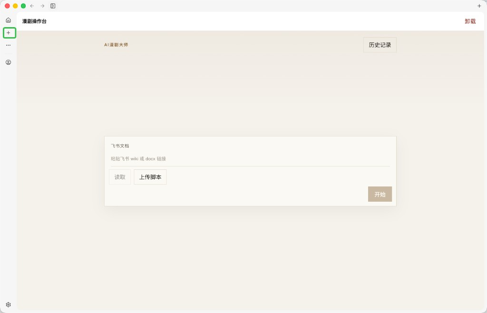
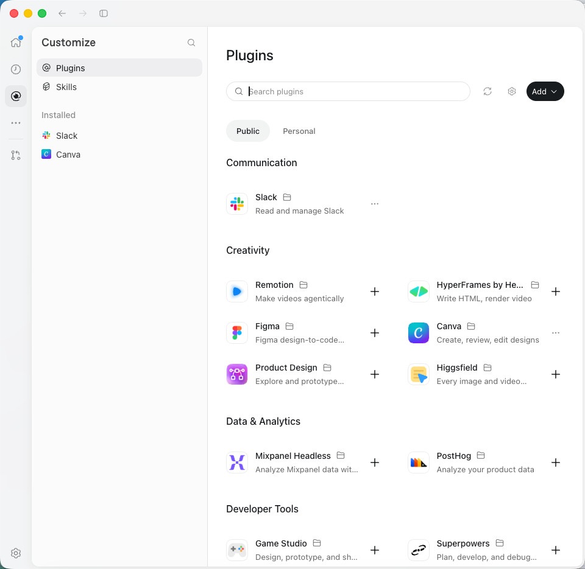
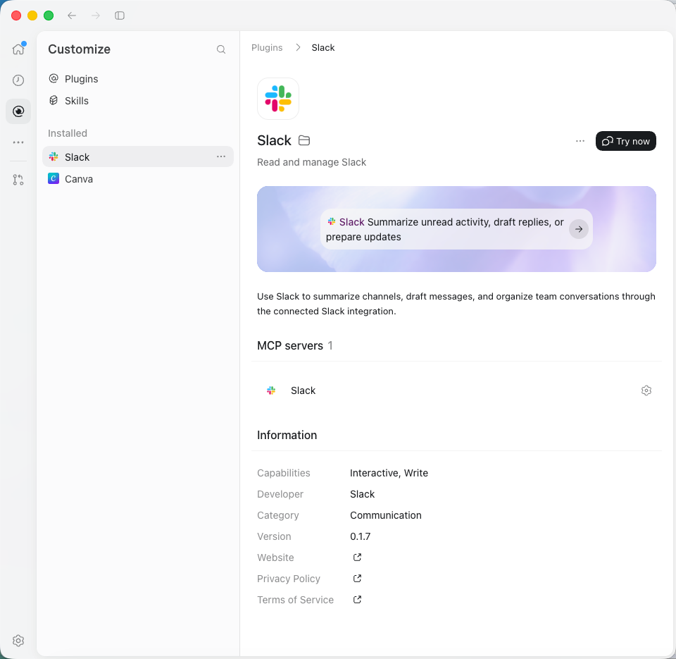
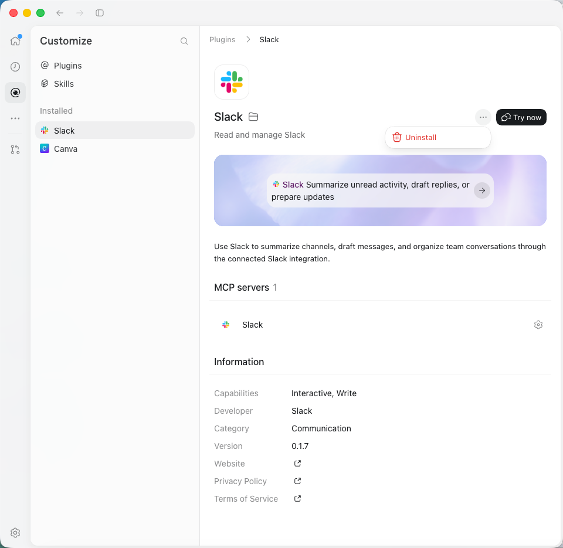
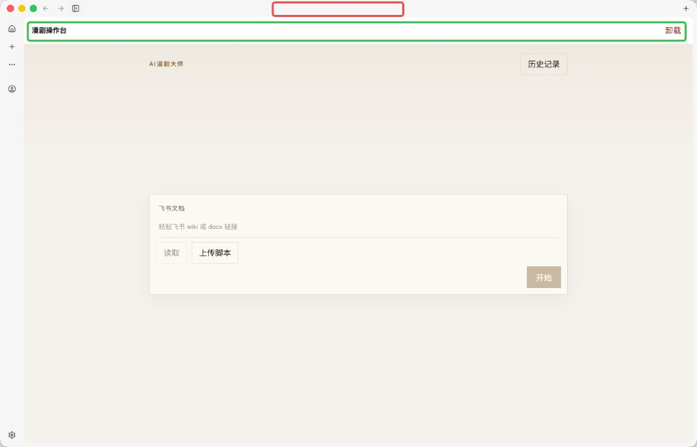
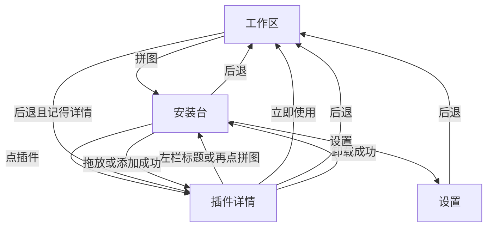
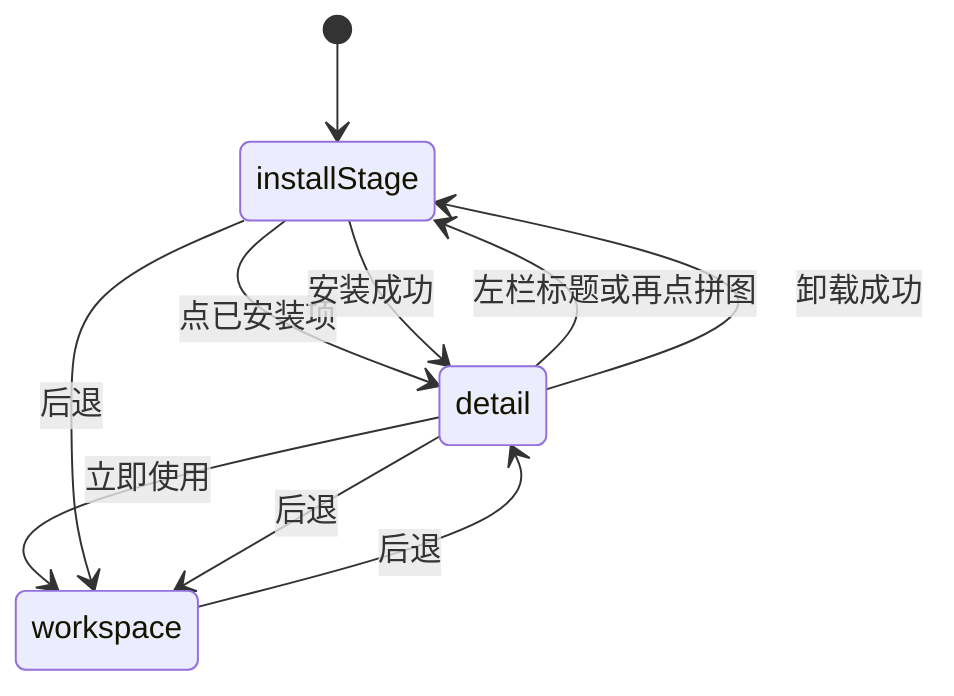
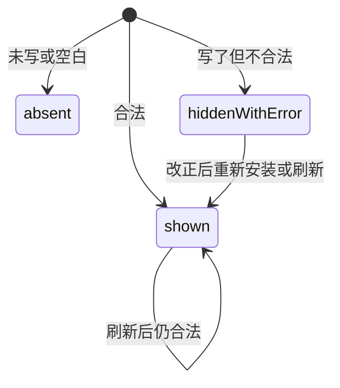

# PRD: 插件页与目录信息

| 属性 | 值 |
|---|---|
| 状态 | 工程：accepted。见文末「工程验收状态」 |
| 范围 | 插件页、工作区插件顶栏、标题栏插件名、`plugin.manifest.json` 的目录信息 |
| 关联文档 | `docs/DESIGN.md`、`docs/plugin-development.md`、`README.md`、`specs/prds/prd-00001-plugin-settings.md`、`specs/prds/prd-00002-workbench-chrome.md` |
| 界面参考 | `specs/prds/images/prd-00003-plugins-page/` |
| 关联实现 | `src/renderer/index.html`、`src/renderer/style.css`、`src/renderer/plugins.js`、`src/renderer/chrome.js`、`src/renderer/chrome-state.js`、`src/renderer/icons.js`、`src/main/types.ts`、`src/main/manifest.ts`、`src/main/registry.ts`、`src/preload/host.cjs` |

## 背景与问题

图标轨上的加号和标题栏右端的加号都会直接弹出 zip 选择框。插件装好之后，名字和「卸载」压在插件自己的页面上，主区留白被壳占掉。插件详情需要的图标、简介、开发者和链接，manifest 里还没有。

要改的是工作台壳和目录信息，不是在线市场：

1. 图标轨的加号改成拼图，打开一页插件管理，而不是立刻选文件。
2. 这一页左边是已加载插件，右边在「安装台」和「详情」之间切换。安装仍是本机 zip：添加按钮走现有选择框，另外给一块占满右栏的拖放台。
3. 详情可以「立即使用」，也可以在菜单里卸载用户安装的插件。
4. 打开插件后，名称和卸载离开插件页面。名称改到标题栏正中。
5. manifest 补上详情能显示的可选字段。旧插件不写这些字段也能加载。

`specs/prds/prd-00001-plugin-settings.md` 的 `configSchema`、`plugin-settings.json` 和 `pluginEnv()` 继续有效。`specs/prds/prd-00002-workbench-chrome.md` 里「加号调用 `pickAndInstall()`」和「主区保留卸载按钮」由本 PRD 覆盖。当前壳的图标轨、嵌入或浮层的宽侧栏、设置分栏保持不动。

## 目标与非目标

### 目标

- 图标轨安装位使用 Lucide `puzzle`，打开插件页。
- 插件页与设置页同一套壳：图标轨留着，主卡片内左栏加右栏，左栏可拖。
- 左栏列出全部已加载插件。右栏默认是安装台；点某一项变成详情。
- 安装台提供刷新、添加和整栏拖放。添加与欢迎页拖放仍安装 zip。
- 详情提供立即使用。仅用户安装的插件能从「…」菜单卸载。
- 工作区去掉插件名称和卸载顶栏，有界面的插件铺满工作区。
- 标题栏正中显示当前插件名，颜色用 `--ink`。
- manifest 增加可选的简介、图标、开发者、分类和三个链接。写错时插件仍加载。

### 非目标

- 在线插件市场、Public / Personal、按分类排的货架、搜索远程插件。
- Codex 详情里的 Capabilities、MCP servers、宣传横幅和黑底胶囊按钮。
- 修改 `configSchema`、配置存储、覆盖安装规则（仍不能覆盖内置或开发路径里的同 id 插件）。
- 要求现有示例插件或已发出的 zip 补目录字段。
- 插件页面内部的前进后退。标题栏后退不在两个插件页面之间切换。
- 为目录信息增加设置项，或把这些字段注入 `pluginEnv()`。

### 成功标准

- 点拼图进入插件页，不出现文件选择框。标题栏右端没有加号。
- 拖入合法 zip 或点添加，安装成功后留在插件页并打开该插件详情。
- 内置和开发插件的详情没有卸载。用户安装的插件可以从菜单卸载，卸载后回到安装台。
- 「立即使用」打开该插件；再点后退回到刚才的详情。
- 有界面的插件页面上看不到壳的名称和「卸载」。标题栏正中是插件名，颜色为 `#171717`。
- 只有 `id`、`displayName`、`version`、`type` 和入口的旧 manifest 仍能安装、列出和打开。多写的目录字段能出现在详情里。

## 术语

| 术语 | 含义 |
|---|---|
| 插件页 | 壳表面 `plugins`。左栏是列表，右栏是安装台或详情 |
| 安装台 | 右栏未选中插件时的视图：标题、刷新、添加和拖放区 |
| 详情 | 右栏选中一个已加载插件时的视图 |
| 已安装列表 | 左栏分区。列出全部已加载插件，含内置、开发和用户安装 |
| 来源 | 行内灰色小字：内置、开发、已安装。只有「已安装」能从界面卸载 |
| 目录信息 | manifest 上可选的简介、图标、开发者、分类和链接 |
| 立即使用 | 离开插件页，在工作区打开该插件 |
| 工作区 | 欢迎页、后台说明或插件内嵌页。表面名 `workspace` |

## 已拍板规则

| 项 | 决定 |
|---|---|
| 入口 | 图标轨 `puzzle` 打开插件页的安装台。已在详情时再点一次，回到安装台。不再调用 `pickAndInstall()` |
| 标题栏加号 | 去掉。安装只留在插件页的「添加」和拖放，以及欢迎页原有拖放 |
| 壳表面 | `workspace`、`settings`、`plugins` 三选一。图标轨在三种表面上都在 |
| 插件页版式 | 主卡片内左右分栏。隐藏工作区宽侧栏和工作区内容。收起按钮隐藏，与设置页相同 |
| 左栏 | 标题「插件」、搜索、分区「已安装」、插件按钮。标题是文字，与设置页相同，没有选中底色，也不能点。回到安装台再点一次拼图 |
| 搜索 | 只匹配 `displayName`，大小写不敏感。无匹配时左栏显示「没有结果」。不因此清掉右栏详情 |
| 列表范围 | 内置、开发、用户安装都列出。行内用来源小字区分。不显示界面/后台胶囊 |
| 左栏宽度 | 220–480px，默认 292px，键 `dex.pluginsNavWidth`。左右方向键每次 16px，双击恢复 292px。与 `dex.sidebarWidth`、`dex.settingsNavWidth` 分开 |
| 安装台顶栏 | 左「插件」，右刷新和「添加」。刷新调用现有 `listPlugins()`。添加调用现有 `pickAndInstall()` |
| 拖放台 | 占满顶栏以下的右栏。虚线、约 20px 圆角、居中 `puzzle` 和两行说明。拖入时只改边框和底色。只有这一栏接受放下 |
| 接受的文件 | 只接受 `.zip`。多个文件只看第一个。非 zip 提示「请拖入 .zip 插件包」 |
| 安装进行中 | 第一次安装结束前，忽略新的拖放，并禁用「添加」 |
| 安装成功 | 留在插件页，选中刚装上的详情。状态「插件已安装」 |
| 安装失败 | 留在安装台，状态用返回的错误文案。同 id 已由内置或开发路径提供时，仍拒绝覆盖 |
| 欢迎页拖放 | 保留，调用同一条 zip 安装。成功后仍停在欢迎页，不跳到插件页，也不自动打开详情 |
| 详情主按钮 | 「立即使用」。有界面则打开 webview；无界面则打开现有后台说明。按钮是浅底细边，不用黑底胶囊 |
| 卸载菜单 | 仅来源为已安装时显示 `ellipsis`。菜单一项「卸载」，文字色 `--danger`，可带 `trash-2`。点外部或 Escape 关闭。无确认框 |
| 卸载结果 | 成功后回到安装台，状态「插件已卸载」，并删掉该插件配置块（现有行为）。若工作区正打开它，工作区改回欢迎页。失败则留在详情并显示错误 |
| 刷新 | 当前详情的 id 还在列表里则保持详情。不在了就回到安装台 |
| 链接 | 网站、隐私政策、服务条款用系统浏览器打开。工作台自己不导航过去 |
| 标题栏名称 | 仅工作区且打开了某个插件时，在标题栏正中显示 `displayName`。颜色 `--ink`（`#171717`），底色仍是 `--titlebar`。插件页和设置页、以及欢迎页，正中为空 |
| 工作区顶栏 | 去掉 `#plugin-toolbar` 的名称和「卸载」。有界面的 webview 铺满工作区。后台说明页去掉卸载按钮，说明文字保留 |
| 目录字段 | 全部可选。未写或空字符串当作没有。写了但不合法时插件仍加载，该字段不显示，详情给出 `catalogError` |
| 从插件页进设置 | 进入设置并丢掉插件页选中态的返回。设置里后退回到工作区，不回到插件页。未保存的设置草稿仍按现有规则丢弃 |
| 主页按钮 | 在插件页或设置页时，回到工作区，效果与标题栏后退相同 |

## 冲突与决议

| 现有说法 | 决议 |
|---|---|
| `docs/DESIGN.md`：标题栏右端是加号；图标轨安装是加号；卸载在主区 | 实现时改文档：右端不加号，正中可显示插件名；图标轨该位是 `puzzle`；卸载只在详情菜单 |
| `prd-00002`：图标轨加号调用 `pickAndInstall()`，主区卸载按钮保持不动 | 本 PRD 覆盖这两句。壳的图标轨、宽侧栏嵌入或浮层、设置分栏不在本篇重做 |
| `docs/plugin-development.md` 与 `README.md` 的 manifest 字段表没有目录信息 | 实现时补上本篇的可选字段和校验 |

## 用户与角色

| 角色 | 目标 |
|---|---|
| 工作台使用者 | 在插件页安装 zip、查看已加载插件、进入使用或卸载 |
| 插件开发者 | 用可选字段提供图标和简介，旧 manifest 不用改也能加载 |
| Dex Buddy 维护者 | 目录信息只用于展示，不进入配置和环境变量 |

## 界面参考

信息架构对照下面五张图。图 05 的红框和绿框是标注，不是界面元素。色值、按钮和圆角以 `docs/DESIGN.md` 为准。本 PRD 不实现参考图里的分类货架、黑底按钮、宣传横幅和 MCP 列表。

图标轨上现在的加号。本 PRD 把它换成拼图，并打开插件页。



插件页的左右关系。左栏是已安装列表，右栏顶上是标题、刷新和添加。右栏主体用本篇的拖放台，不用图里的分类卡片。



详情。图标、名称、简介、立即使用，以及下面的信息表。没有图中的横幅和 MCP。



详情右上角的菜单。只保留卸载。



工作区。绿框里的插件名和卸载去掉。红框处，也就是标题栏正中，显示插件名。



| 文件 | 对照什么 |
|---|---|
| `specs/prds/images/prd-00003-plugins-page/01-rail-plus.jpg` | 要替换的图标轨加号 |
| `specs/prds/images/prd-00003-plugins-page/02-codex-plugins.png` | 左栏已安装列表，右栏标题、刷新和添加 |
| `specs/prds/images/prd-00003-plugins-page/03-plugin-detail.png` | 详情的图标、简介、立即使用和信息表 |
| `specs/prds/images/prd-00003-plugins-page/04-uninstall-menu.png` | 「…」菜单里的卸载 |
| `specs/prds/images/prd-00003-plugins-page/05-titlebar-name.jpg` | 去掉插件页顶栏，名称放到标题栏正中 |

## 功能域

### 插件页

`body` 增加表面 `plugins`。打开时隐藏工作区宽侧栏、分隔和工作区内容，显示插件左栏、插件分隔和插件右栏。图标轨保持可见。收起按钮隐藏。进入插件页时挂起当前 webview，与进入设置时相同。

左栏标题是 `h2`，和设置页相同，没有选中底色，也不能点。回到安装台再点一次拼图。搜索框占位「搜索」，规则见已拍板表。列表项是图标、插件显示名和来源小字，选中态沿用浅灰圆角条。没有 `icon` 时用默认拼图。空列表文案「还没有插件」。

右栏状态单独一条，不复用被藏起来的工作区 `#status`。成功用 `--ok`，失败用 `--danger`。没有文案时不占高度。

### 安装台

顶栏左侧标题「插件」。刷新是 32px 图标按钮，Lucide `refresh-cw`，无障碍名「刷新」。添加是浅灰底、细边框、圆角 10px 的文字按钮，文案「添加」，可带 `plus`。

拖放区在顶栏之下撑满右栏，四周留出与欢迎页卡片相近的边距。边框 1px 虚线、颜色 `--line`，圆角 20px，阴影只用 `--shadow`。内容居中：48px 的 `puzzle`、第一行「把插件压缩包拖到这里」、第二行「或点右上角的添加，选择 .zip」。第二行用 `--muted`。拖拽经过时边框改为 `#d0d0d0`、底色 `--hover`、文字 `--ink`。焦点环 2px `--focus`。

放下目标是整个安装台右栏。左栏、详情右栏和工作区不接受安装放下。欢迎页 `#drop-zone` 保持原样。

### 详情

顶部是三列：56px 图标、名称和简介、右侧操作。名称用 `--text-page`（22px、字重 600），与设置页插件标题相同。名称右侧是文件夹，悬停或聚焦时在上方显示该插件目录的绝对路径。名称行右端先是「…」，再是「立即使用」。没有卸载资格时不渲染「…」。

图标用 `` 显示 `app-plugin://` 上的文件，不把 SVG 内联进壳的 DOM。没写 `icon`、文件不存在或加载失败时，改用浅底圆角上的拼图，不用显示名首字。

简介在名称下方，有 `description` 才显示，颜色 `--muted`，自动换行。其下是分区标题「信息」，然后是表。表的左列是 `--muted` 标签，右列是值。行顺序固定，没有值的行不渲染：

| 标签 | 值 |
|---|---|
| 类型 | 界面或后台，来自 `type` |
| 来源 | 内置、开发或已安装 |
| 版本 | `version` |
| 开发者 | `developer` |
| 分类 | `category` |
| 网站 | 外链按钮 |
| 隐私政策 | 外链按钮 |
| 服务条款 | 外链按钮 |

外链按钮使用 Lucide `external-link`，无障碍名带上标签和 URL。点击调用宿主打开系统浏览器。打开失败时右栏状态为「无法打开链接」。

`catalogError` 有内容时，显示在信息表上方，样式与设置页的声明错误相同。合法字段仍显示。

菜单从「…」向下打开，白底、1px `--line`、圆角约 12px、阴影 `--shadow`。只有「卸载」。

### 标题栏名称

在 `#titlebar` 里绝对居中，垂直居中，单行省略。字号 13px，字重 560，颜色 `--ink`，无底、无边框。`pointer-events: none`，以免挡住窗口拖拽。左右按钮占位时，名称最大宽度让开两侧控件。元素不是按钮。

工作区打开有界面插件或后台插件时写入 `displayName`。欢迎页、插件页、设置页时清空。

### 工作区

删除 `#plugin-toolbar`。`#viewport-host` 在工作区里继续铺满剩余高度。后台说明保留标题和「该工具没有界面，已在系统后台运行。」，去掉「卸载此插件」。

从主页宽侧栏打开插件的行为不变，同时更新标题栏名称。这里不产生「回到插件详情」的后退。

覆盖安装了工作区正在打开的那个 id 之后，下次回到工作区时重新准备并打开它。

### 目录信息

字段写在 `plugin.manifest.json` 顶层，与 `displayName` 平级。不要包进新对象。

```json
{
  "id": "my-tool",
  "displayName": "我的工具",
  "version": "1.0.0",
  "type": "ui",
  "main": "index.js",
  "uiEntry": "ui/index.html",
  "description": "把稿件做成一集漫剧",
  "icon": "icon.png",
  "developer": "互远",
  "category": "创作",
  "website": "https://example.com",
  "privacyPolicy": "https://example.com/privacy",
  "termsOfService": "https://example.com/terms"
}
```

| 字段 | 合法 | 不合法时 |
|---|---|---|
| `description` | 去掉首尾空白后 1–280 个字符 | 不显示简介，写入 `catalogError` |
| `icon` | 插件目录内相对路径，扩展名为 png、jpg、jpeg、webp、svg，且文件存在 | 显示默认拼图，写入 `catalogError` |
| `developer` | 去掉首尾空白后 1–64 个字符 | 不显示该行，写入 `catalogError` |
| `category` | 去掉首尾空白后 1–32 个字符 | 不显示该行，写入 `catalogError` |
| `website`、`privacyPolicy`、`termsOfService` | `http` 或 `https`，有主机名，长度不超过 300 | 不显示该行，写入 `catalogError` |

未出现或去掉空白后为空：当作没写，不算错误。类型不是字符串：算错误。路径规则与 `uiEntry` 相同，拒绝绝对路径和 `..`。多条错误合成一段 `catalogError`。插件仍扫描、安装和打开。这些字段不进入 `getPluginConfig()` 或 `pluginEnv()`。

列表接口把目录信息一并带回，详情不再单独请求。`PluginSummary` 增加可选的 `description`、`iconUrl`、`developer`、`category`、`website`、`privacyPolicy`、`termsOfService` 和 `catalogError`，以及必有的 `rootPath`（插件目录绝对路径，只给文件夹提示用）。`iconUrl` 形如 `app-plugin://<id>/<icon>`。`rootPath` 不进 manifest，也不进 `pluginEnv()`。

宿主桥增加 `openExternal(url)`。主进程再次检查协议，只打开 `http:` 和 `https:`。

### 壳历史

在现有工作区与设置的记忆上增加插件页。纯函数仍放在 `src/renderer/chrome-state.js`，会话只活在内存里。

记忆的字段：

| 字段 | 含义 |
|---|---|
| `surface` | `workspace`、`settings` 或 `plugins` |
| `pluginsFocus` | 详情的插件 id；安装台为 `null` |
| `back` | 仅在工作区有意义：`null`，或要回到的插件详情 |
| `forward` | `null`、设置，或插件页（含当时的 `pluginsFocus`） |

| 动作 | 结果 |
|---|---|
| 冷启动 | 工作区，`back` 和 `forward` 都为空 |
| 从工作区或设置点拼图 | 进入安装台，清空 `back` 和 `forward`。离开设置时丢掉未保存草稿 |
| 在插件页再点拼图，或点左栏标题 | 若在详情，回到安装台；已在安装台则不变 |
| 点列表项 | 停留在插件页，`pluginsFocus` 改为该项 |
| 插件页或设置页后退，或点主页 | 回到工作区。`forward` 记着刚离开的设置或插件页（含选中项）。`back` 清空 |
| 前进 | 再次进入 `forward` 指向的设置或插件页，然后清空 `forward` |
| 立即使用 | 工作区打开该插件。`back` 指向该详情。`forward` 清空 |
| 工作区后退，且 `back` 指向详情 | 打开该详情。`back` 和 `forward` 都清空。不把「再进插件」放进前进 |
| 在工作区从宽侧栏打开插件、回到欢迎页、欢迎页拖放安装、点亮或熄灭收起 | 清空 `back` 和 `forward` |
| 从插件页打开设置 | 进入设置，清空 `back` 和 `forward`。之后后退到工作区 |

前进不会从详情再跳进刚才使用的插件页面。插件之间的切换仍然不进栈。

### 图标

沿用 Lucide，16px、描边 1.5、`currentColor`。在现有注册表上改这几项：

| 位置 | Lucide 名称 |
|---|---|
| 图标轨插件页 | `puzzle` |
| 安装台刷新 | `refresh-cw` |
| 安装台添加、拖放区 | `plus`、`puzzle` |
| 详情菜单按钮 | `ellipsis` |
| 卸载 | `trash-2` |
| 外链 | `external-link` |

标题栏不再使用 `plus`。

## 用户故事地图与版本切片

### 旅程主干

| 步骤 | 节点 | 说明 |
|---|---|---|
| 1 | Entry | 工作区打开着一个插件，标题栏正中是它的名字 |
| 2 | 进入 | 点拼图，看到安装台和已安装列表，webview 挂起 |
| 3 | 安装 | 把 zip 拖进右栏，或点添加 |
| 4 | 查看 | 安装成功后右栏是这个插件的详情 |
| 5 | 使用 | 点立即使用，工作区打开它，标题栏换上它的名字 |
| 6 | Exit | 点后退，回到刚才的详情。再后退，回到工作区里的这个插件 |

从第 2 步也可以不安装，直接点列表里已有的插件，然后走到第 5 步。卸载从第 4 步分出：成功后回到安装台，再后退则进入欢迎页或仍然开着的另一个插件。

### 故事地图

| 阶段 | 用户目标 | 用户故事 | 验收要点 |
|---|---|---|---|
| 进入 | 打开插件页 | 作为使用者，我想点拼图进入插件页，以便管理插件而不是立刻选文件 | 图标是 `puzzle`；进入安装台；不出现文件选择框；图标轨仍在；收起按钮不可见 |
| 进入 | 回到安装台 | 作为使用者，我想从详情回到拖放区，以便再装一个 | 再点拼图后，右栏是安装台，列表无选中。左栏标题不能点 |
| 浏览 | 看见已加载插件 | 作为使用者，我想在左栏看到全部插件，以便知道有哪些可用 | 内置、开发、用户安装都在；行内有来源小字；没有界面/后台胶囊 |
| 浏览 | 搜索 | 作为使用者，我想按名字搜索，以便插件多时能找到 | 只匹配显示名；无匹配显示「没有结果」；右栏详情保持 |
| 浏览 | 调整栏宽 | 作为使用者，我想拖动插件页分隔，以便左栏够用 | 宽度 220–480；写入 `dex.pluginsNavWidth`；双击恢复 292；不影响另外两个宽度键 |
| 安装 | 拖放安装 | 作为使用者，我想把 zip 拖进右栏，以便不用找文件框 | 只有安装台右栏接受；成功后选中新详情并显示「插件已安装」；非 zip 有错误文案 |
| 安装 | 选择文件 | 作为使用者，我想点添加选出 zip，以便不用拖放 | 调用 `pickAndInstall()`；取消则留在安装台；成功规则与拖放相同 |
| 安装 | 避免重复安装 | 作为使用者，我想在一次安装完成前不能再装，以免两包交错 | 进行中忽略拖放且添加禁用；结束后恢复 |
| 安装 | 拒绝覆盖内置 | 作为使用者，我想在 id 与内置插件冲突时看到失败，以便不弄坏内置副本 | 留在安装台；文案说明已由内置或开发路径提供 |
| 安装 | 沿用欢迎页 | 作为使用者，我想仍能在欢迎页拖入 zip，以便不用先打开插件页 | 欢迎页拖放仍可用；成功后停在欢迎页 |
| 详情 | 看信息 | 作为使用者，我想看到类型、来源、版本和作者提供的简介与链接，以便决定要不要使用 | 信息表按本篇顺序；缺省行不出现；外链用系统浏览器打开 |
| 详情 | 缺图标也能认 | 作为使用者，我想在没有图标时仍看到一块插件图标，以便列表和详情都能认 | 无 `icon` 或图片加载失败时显示默认拼图 |
| 详情 | 声明写错仍能用 | 作为插件作者，我想字段写错时插件照样加载，以便先能打开再改正 | 插件出现在列表里；非法字段不显示；详情有 `catalogError` |
| 使用 | 进入插件 | 作为使用者，我想点立即使用，以便直接用这个插件 | 有界面打开 webview；无界面打开后台说明；标题栏名称更新；插件页关闭 |
| 使用 | 从使用退回详情 | 作为使用者，我想后退回到刚才的详情，以便继续卸载或查看 | 后退打开该详情；此时前进不可用 |
| 使用 | 看全插件页面 | 作为使用者，我想让插件页面占满工作区，以便操作区域最大 | 工作区没有名称和卸载顶栏；webview 铺满；标题栏正中是名称，颜色 `#171717` |
| 卸载 | 卸掉自己装的 | 作为使用者，我想在菜单里卸载，以便去掉不需要的插件 | 仅已安装来源有菜单；成功后回安装台，列表不再有它；配置块按现有规则删除 |
| 卸载 | 保护内置和开发插件 | 作为使用者，我想对内置和开发插件看不到卸载，以便不会误删 | 这两类详情没有「…」 |
| 历史 | 退回工作区 | 作为使用者，我想从安装台后退，以便回到进来之前的插件 | 后退恢复进入插件页之前的工作区内容 |
| 历史 | 设置不夹在中间 | 作为使用者，我想从插件页打开设置后再后退，以便回到工作区 | 后退到工作区，不是插件页；设置草稿不写盘 |
| 空状态 | 没有插件 | 作为使用者，我想在一个都没有时知道可以拖入，以便开始安装 | 左栏「还没有插件」；右栏仍是拖放台 |

### Release 0

可验收结果：

- 图标轨 `puzzle` 打开插件页；标题栏加号移除；标题栏正中按规则显示插件名。
- 插件页左栏、搜索、可拖分隔、安装台、拖放、添加、刷新、详情、立即使用、卸载菜单。
- 欢迎页拖放仍在，成功后不离开欢迎页。
- 工作区去掉插件顶栏和后台说明上的卸载。
- manifest 可选目录字段、校验、`catalogError`，以及列表数据把这些字段带到渲染进程。
- `openExternal` 只打开 http(s)。
- 壳历史按「壳历史」表工作，并用 `node:test` 覆盖：进入安装台、选中详情、后退回工作区、立即使用后再后退回详情、打开另一个插件后清空这段后退、从插件页进入设置再后退到工作区。
- `parseManifest` 的测试覆盖：字段缺省、空字符串、合法目录信息、非法 URL、越界图标路径。非法时返回的 manifest 仍可加载，并带 `catalogError`。
- 实现时回写 `docs/DESIGN.md`、`docs/plugin-development.md`、`README.md`。色板、圆角、焦点环和「不用 React」仍然有效。

没有 Release 1。在线市场另写 PRD。

## 核心流程与状态机图





目录字段在单个插件上的展示状态：



`absent` 不占详情里的行，也没有错误。`hiddenWithError` 不显示该字段，详情保留 `catalogError`。插件本身始终处于已加载。

## 数据与 API 衔接

不新增配置文件。目录信息不写入 `plugin-settings.json`。

| 存储 | 键 | 内容 |
|---|---|---|
| `localStorage` | `dex.pluginsNavWidth` | 插件页左栏宽度 |

壳表面、`pluginsFocus`、`back` 和 `forward` 只在本次会话的内存里。

渲染进程继续用 `listPlugins`、`pickAndInstall`、`installZip`、`uninstall`、`preparePlugin`。`listPlugins` 的每条记录带上目录字段和 `catalogError`。新增 `openExternal(url)`，主进程拒绝非 http(s)。

安装和卸载的文件规则不变：只卸载 `source === installed`；覆盖安装不能替换内置或开发路径中的同 id。

## 假设与待确认

| 项 | 处理 |
|---|---|
| 分类先是自由文本 | 详情只展示，不做货架。市场的分类法以后单独立项 |
| 外链由系统浏览器打开 | 工作台不内嵌这些网页 |
| 旧 zip 没有目录字段 | 详情用类型、来源、版本和默认拼图，不算错误 |

无未决产品分叉。

## 修订记录

| 日期 | 说明 |
|---|---|
| 2026-10-09 | 初稿。插件页、安装台、详情与卸载、标题栏插件名、可选目录字段。参考图在 `specs/prds/images/prd-00003-plugins-page/` |
| 2026-10-09 | 左栏标题改为不可点的文字。无图标用默认拼图。详情页眉为图标、名称、文件夹目录提示和简介 |

## 1. 工程验收状态

> 由 `/team:prd-accept` 维护；勿手工编造「通过」。最后更新：2026-10-09T08:53:34Z，dev 工作区（HEAD `22f5734` 尚不含本篇实现），范围：R0,R1。

### 总览

- 工程状态：`accepted`
- 验收判定：Release 0 纳入项均通过。正文声明没有 Release 1，在线市场标为范围外。
- 最近验收：2026-10-09T08:53:34Z
- 代码提交：插件页实现仍在工作区，未提交。当前 HEAD 为 `dev@22f5734`。
- 拼图打开插件页，安装、详情、立即使用、卸载和标题栏插件名按修订后的规则落地。
- 目录字段可选，写错仍加载并带 `catalogError`；`openExternal` 只放行 http(s)。
- 壳历史由 `chrome-state.js` 的 `node:test` 覆盖进入、选中、后退、立即使用后再退回详情、以及从插件页进设置再退回工作区。
- `pnpm test` 49 项通过。`docs/DESIGN.md`、`docs/plugin-development.md`、`README.md` 已写入插件页和目录字段。

### Release 交付

| Release | 状态 | 说明 |
|---|---|---|
| R0 | 通过 | 插件页、安装台、详情、卸载、标题栏名称、目录信息和壳历史均有实现与测试 |
| R1 | 范围外 | 正文写明没有 Release 1，在线市场另写 PRD |

### 功能验收清单（Agent 优先读此表）

| ID | 能力摘要 | Release | 状态 | 证据 |
|---|---|---|---|---|
| US-01 | 拼图进入安装台，不弹出选文件；图标轨仍在，收起按钮隐藏 | R0 | 通过 | `src/renderer/index.html` 轨按钮 `puzzle`；`src/renderer/chrome.js` `openPlugins` / `collapseBtn.hidden`；`test/chrome-state.test.ts` |
| US-02 | 再点拼图回安装台；左栏标题不可点 | R0 | 通过 | `enterPlugins`；`#plugins-heading` 为 `h2`，无点击监听 |
| US-03 | 左栏列出内置、开发、已安装，行内来源小字，无界面/后台胶囊 | R0 | 通过 | `src/renderer/plugins-page.js` `SOURCE_LABEL` |
| US-04 | 搜索只匹配显示名；无匹配显示「没有结果」；不改右栏详情 | R0 | 通过 | `plugins-page.js` 搜索只调用 `renderList` |
| US-05 | 左栏宽 220–480，默认 292，键 `dex.pluginsNavWidth`，双击恢复 | R0 | 通过 | `src/renderer/sidebar.js`；`splitWidthKey` 测试 |
| US-06 | 安装台拖放 zip；成功选中详情并显示「插件已安装」；非 zip 有错误文案 | R0 | 通过 | `plugins-page.js` `finishInstall`、`请拖入 .zip 插件包` |
| US-07 | 「添加」调用 `pickAndInstall()`；取消留在安装台 | R0 | 通过 | `plugins-page.js`；`finishInstall` 在 `cancelled` 时返回 |
| US-08 | 安装进行中忽略拖放并禁用「添加」 | R0 | 通过 | `plugins-page.js` `installing` |
| US-09 | 与内置或开发插件同 id 时拒绝覆盖，留在安装台 | R0 | 通过 | `test/registry.test.ts`「不能用安装包覆盖内置插件」；失败时 `enterPlugins()` |
| US-10 | 欢迎页拖放仍可用，成功后不离开欢迎页 | R0 | 通过 | `src/renderer/plugins.js` 放下后只 `refresh`，不进入插件页 |
| US-11 | 信息表按固定顺序；缺省行不出现；外链走系统浏览器 | R0 | 通过 | `plugins-page.js` 信息行与 `openExternal` |
| US-12 | 无图标或图片失败时用默认拼图 | R0 | 通过 | `plugins-page.js` `pluginMark`；`docs/DESIGN.md` |
| US-13 | 目录字段写错仍加载，非法字段不显示，详情有 `catalogError` | R0 | 通过 | `src/main/manifest.ts`；`test/catalog.test.ts` |
| US-14 | 「立即使用」打开界面或后台说明，更新标题栏名称并离开插件页 | R0 | 通过 | `plugins-page.js` `usePlugin`；`chrome.js` `titlebar-plugin-name` |
| US-15 | 使用后后退回到该详情，此时前进不可用 | R0 | 通过 | `test/chrome-state.test.ts`「using a plugin then going back」 |
| US-16 | 工作区无名称和卸载顶栏；标题栏正中名称色 `#171717` | R0 | 通过 | 无 `#plugin-toolbar`；`#titlebar-plugin-name` 使用 `--ink`（`#171717`） |
| US-17 | 仅已安装来源可卸载；成功回安装台并删除配置块 | R0 | 通过 | `plugins-page.js` `source === 'installed'`；`test/registry.test.ts` 卸载删除配置 |
| US-18 | 内置和开发插件详情没有「…」 | R0 | 通过 | 同上，菜单只在 `installed` 时渲染 |
| US-19 | 从安装台后退回到进入前的工作区 | R0 | 通过 | `test/chrome-state.test.ts`「selecting a plugin keeps the page and back returns to the workspace」 |
| US-20 | 从插件页进设置后再后退，回到工作区而不是插件页 | R0 | 通过 | `test/chrome-state.test.ts`「settings opened from the plugins page goes back to the workspace」 |
| US-21 | 没有插件时左栏「还没有插件」，右栏仍是拖放台 | R0 | 通过 | `plugins-page.js` 空列表文案；安装台在 `index.html` |
| TECH-01 | `openExternal` 只打开 http(s) | R0 | 通过 | `src/main/index.ts` `isHttpUrl`；`test/catalog.test.ts` |
| TECH-02 | 壳历史与 `parseManifest` 目录字段有 `node:test` | R0 | 通过 | `test/chrome-state.test.ts`、`test/catalog.test.ts` |
| TECH-03 | 回写设计、插件开发和 README | R0 | 通过 | `docs/DESIGN.md`、`docs/plugin-development.md`、`README.md` |
| R1-01 | 在线插件市场 | R1 | 范围外 | 正文「没有 Release 1。在线市场另写 PRD。」 |

### 未完成与遗留

- 插件页代码和本 PRD 都还在工作区，没有提交。`dev@22f5734` 不包含这些文件。
- 「壳历史」表和后文状态图仍写「点左栏标题回到安装台」。修订记录和故事地图已改为标题不可点。实现按修订：标题没有点击，再点拼图回到安装台。

### 质量检查

| 检查项 | 状态 |
|---|---|
| pnpm test | 通过，49 项 |
| 文档同步（README / docs/doc_index.md） | 通过。README 与 `docs/plugin-development.md`、`docs/DESIGN.md` 已写目录字段和插件页；`docs/doc_index.md` 指向 DESIGN |

---

统计：通过 24 / 部分 0 / 未实现 0 / 范围外 1
