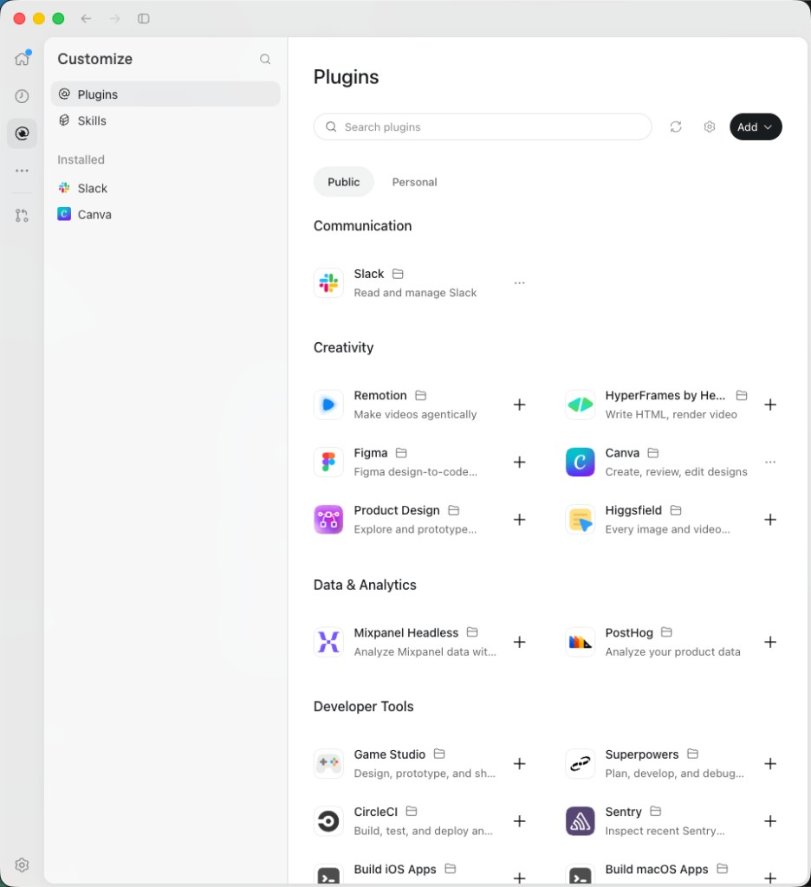
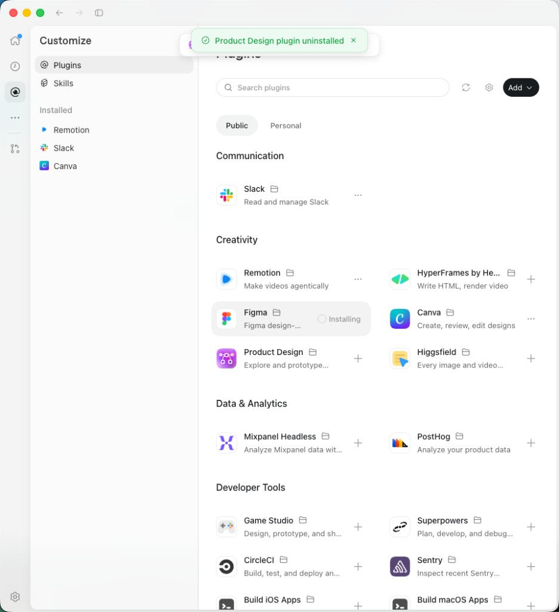
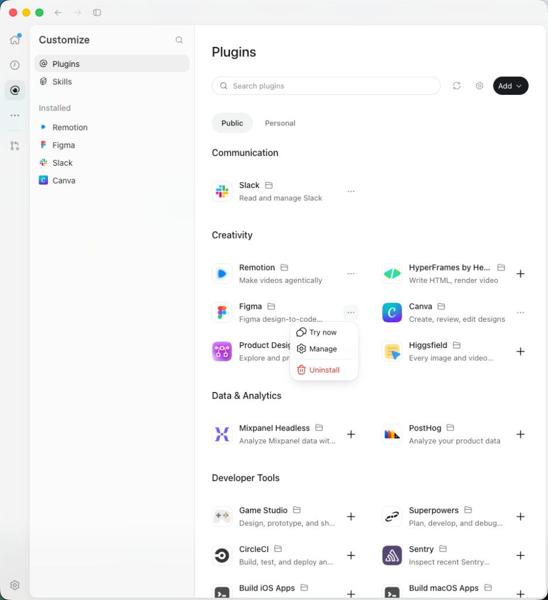
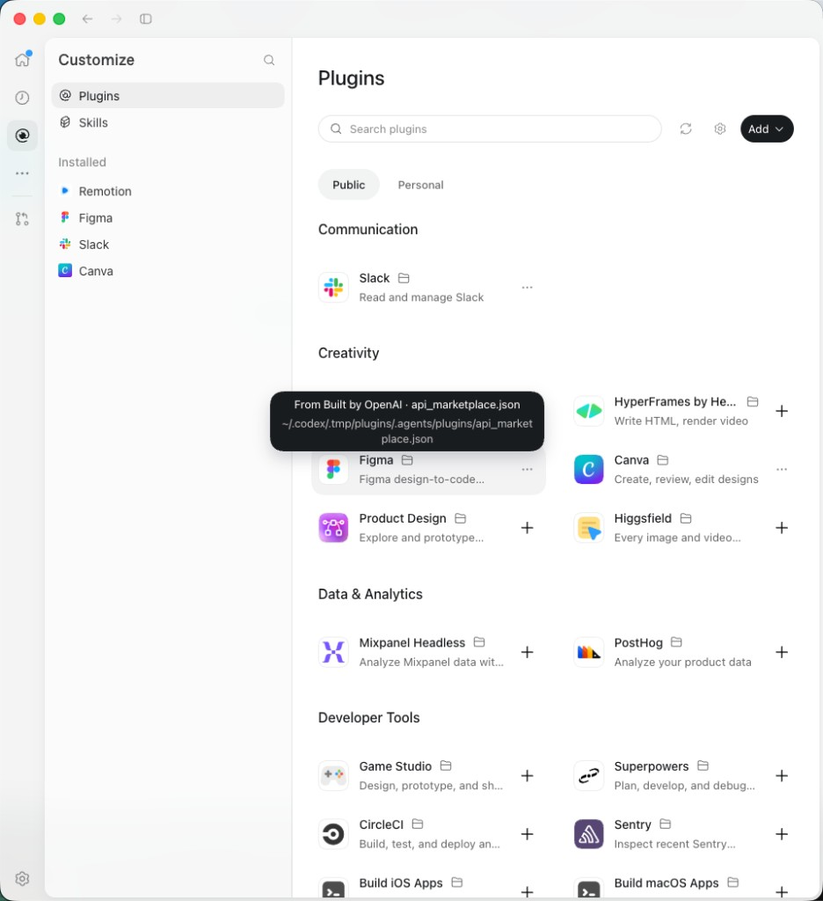
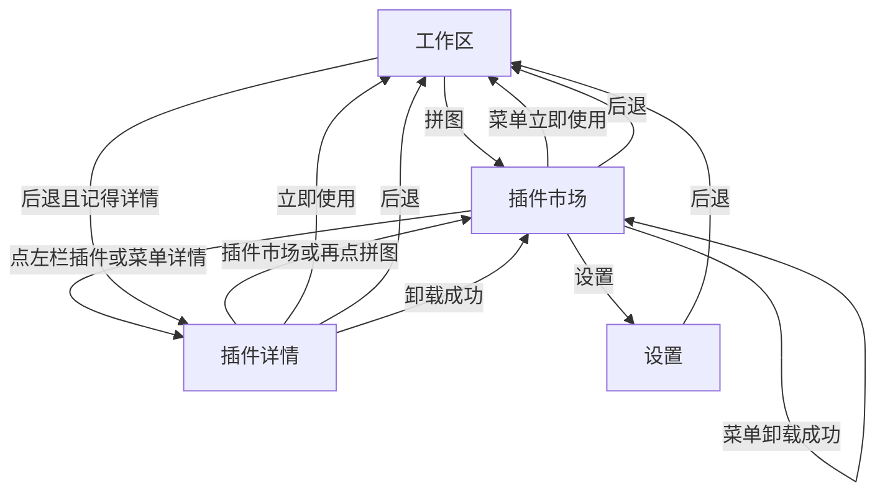
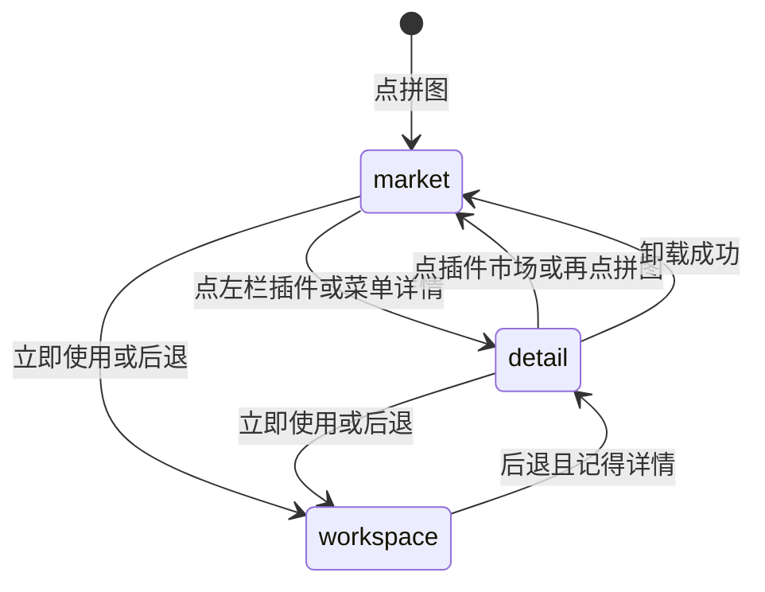
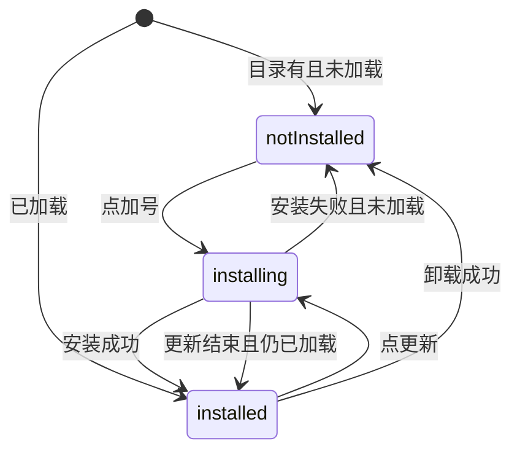

# PRD: 插件市场

| 属性 | 值 |
|---|---|
| 状态 | backlog |
| 范围 | 插件页左栏入口、市场货架、安装进度与 toast、插件目录的图标和分类 |
| 关联文档 | `docs/DESIGN.md`、`docs/workflows/publish-plugin.md`、`docs/plugin-development/manifest.md`、`docs/plugin-development/distribute.md`、`README.md`、`specs/prds/prd-00003-plugins-page.md` |
| 界面参考 | `specs/prds/images/prd-00004-plugin-market/` |
| 关联实现 | `src/renderer/index.html`、`src/renderer/style.css`、`src/renderer/plugins-page.js`、`src/renderer/icons.js`、`src/renderer/chrome-state.js`、`src/main/plugin-catalog.ts`、`src/main/plugin-pack.ts`、`src/main/index.ts`、`scripts/sync-plugin-catalog.ts` |

## 背景与问题

插件页右栏默认是一整块拖放台，在线目录藏在「插件中心」里，列表只有名称、版本和「安装」按钮。压缩包已经不是主要安装方式，这块空台占着打开插件页后的第一眼。

目录 `index.json` 现在有名称、版本和简介，没有图标和分类。未安装的插件无法按 CodeX 那种货架排开。安装结果写在右栏里的一行状态文字上，和页面正文挤在一起。

本篇把市场变成插件页的默认右栏，卡片按分类排，压缩包收进顶栏加号。左栏点已安装插件、详情、立即使用和卸载资格保持 `specs/prds/prd-00003-plugins-page.md` 的规则。

## 目标与非目标

### 目标

- 左栏搜索下面、「已安装」上面有一行「插件市场」。点它进入货架；点已安装插件仍打开现在的详情。
- 打开插件页时默认就是市场。插件页不再有拖放台，也不再有「插件中心 / 安装台」两个视图来回切。
- 压缩包只从市场顶栏的加号进入现有文件选择。欢迎页拖放保持不动。
- 货架按 `category` 分段、两列卡片。每张有图标、名称、文件夹、简介和右侧动作。
- 没安装也能看到预计安装路径。点加号后，这张卡片显示不定进度的环，直到下载、解压、加载和运行环境准备结束。
- 安装、更新、卸载的结果用顶栏 toast，不再用插件页状态行。
- 发布目录增加可选的 `iconUrl` 和 `category`。旧目录没有这两项时仍能列出。

### 非目标

- 欢迎页的拖放区。
- 详情页的版式、信息表、文件夹提示和详情里的「…」菜单。
- 设置页、`configSchema`、`pluginEnv()`。
- Public / Personal 两个标签、Skills、黑色 Add 下拉、顶栏齿轮。
- 用 Git 克隆安装插件。
- 按已下载字节显示百分比。没有进度事件，不用假百分比。
- 为了补图标而重传七牛上已经存在的 zip。已发布版本要等下一个 `vX.Y.Z` 才会带上新字段。

### 成功标准

- 点拼图进入插件页，右栏是市场，左栏「插件市场」为选中，不出现拖放台，也不出现文件选择框。
- 左栏点一个已安装插件，右栏仍是现在的详情；再点「插件市场」或再点一次拼图，回到市场，列表无选中。
- 市场顶栏加号能选出 zip 并安装。欢迎页拖入 zip 仍然停在欢迎页。
- 目录里有 `category` 和 `iconUrl` 的未安装插件，按分类出现，并显示该图标。没有分类的归入「其他」。没有图标或图片打不开时用默认拼图。
- 未安装卡片的文件夹能看到 `userData/installed_plugins/<id>/`。已加载的卡片显示该插件的真实 `rootPath`。
- 点卡片加号后，只有这一张变成「正在安装」，直到运行环境准备结束。成功或失败都留在市场，并出现 toast。
- 已安装卡片的「…」能立即使用、打开详情、在有资格时卸载、在有更新时更新。内置和开发插件没有卸载，也不能被市场覆盖。

## 术语

| 术语 | 含义 |
|---|---|
| 插件市场 | 左栏的一行入口。选中时右栏是货架，`pluginsFocus` 为 `null` |
| 货架 | 市场右栏：搜索、刷新、加号，以及按分类排的卡片 |
| 卡片 | 目录里的一个插件。图标、名称、文件夹、简介、右侧动作 |
| 预计路径 | 尚未安装时，主进程给出的 `userData/installed_plugins/<id>/` |
| 来源 | 已加载插件沿用内置、开发、已安装。只在目录里、还没加载的，来源显示「插件中心」 |
| toast | 顶栏下方居中的一条结果。一句文案、状态图标、关闭 |

## 已拍板规则

| 项 | 决定 |
|---|---|
| 入口位置 | 搜索框下面、分区「已安装」上面。一行按钮，前面 Lucide `layout-grid`，文字「插件市场」 |
| 选中 | 表面是插件页且 `pluginsFocus` 为 `null` 时，这一行是选中态。点某个已安装插件后，这一行取消选中，列表项选中 |
| 默认 | 从工作区或设置点拼图，进入市场。已在详情时再点拼图，回到市场。不新增会话字段 |
| 左栏搜索 | 仍只过滤已安装列表的 `displayName`。不过滤货架，也不藏起「插件市场」这一行 |
| 拖放台 | 从插件页删除。拖到插件页不安装。欢迎页 `#drop-zone` 保持原样 |
| 顶栏 | 左标题「插件」。右起搜索、刷新、加号。搜索占位「搜索插件」，只匹配目录项的 `displayName` |
| 加号 | 32px 图标按钮，Lucide `plus`，无障碍名「添加插件」。点击调用现有 `pickAndInstall()`。不是黑底胶囊，也没有下拉 |
| 刷新 | Lucide `refresh-cw`，无障碍名「刷新插件市场」。重新读取目录，并刷新已加载列表。人仍留在市场 |
| 分类 | 用目录里的 `category` 原文字分段。段名用 `--text-section`、颜色 `--ink`。按 `zh-CN` 排序，「其他」固定在最后。一段里的卡片按 `displayName` 同样排序 |
| 没有分类 | 归入段名「其他」。作者自己把分类写成「其他」时，和缺省的归在同一段 |
| 列数 | 右栏宽度至少 640px 时两列，否则一列。列间距 24px，行间距 8px |
| 卡片内容 | 32px 图标、圆角 8px；名称；名称旁文件夹；有简介才在名称下显示，最多两行，颜色 `--muted`。不在卡片上写版本号 |
| 图标 | 有通过校验的 `iconUrl` 时用 `` 加载。不把 SVG 内联进壳的 DOM。没写、校验失败或图片打不开时，用浅底圆角上的拼图 |
| 文件夹 | 沿用详情的 `.plugin-folder` 和深色 `.plugin-folder-tip`。悬停或聚焦时在上方两行：第一行来源，第二行绝对路径 |
| 路径 | 该 id 已加载时用它的 `rootPath`。未加载时用主进程返回的 `installPath`，等于 `app.getPath('userData')/installed_plugins/<id>/`。渲染进程不自己拼用户数据目录 |
| 打开目录 | 已加载时，点击文件夹调用现有 `openPluginFolder(rootPath)`。未加载时点击不调用，也不创建目录 |
| 未安装动作 | 右侧加号，无障碍名「安装」加显示名。点击安装这个目录项 |
| 安装中 | 这一张底色 `--hover`、圆角 8px。加号换成 16px 不定进度环和「正在安装」。环用 CSS，不知道总字节数。`prefers-reduced-motion: reduce` 时环不旋转，文案仍在 |
| 结束条件 | 环一直保持到 `installCatalogPlugin` 返回，并且运行环境准备已经结束。成功后卡片变为已安装。失败后回到加号 |
| 同时一个 | 任一安装或更新进行中，顶栏加号和其它卡片的加号都禁用。进行中忽略新的点击 |
| 已安装动作 | 右侧 `ellipsis`。菜单白底、1px `--line`、圆角约 12px、阴影 `--shadow`。点外部或 Escape 关闭 |
| 菜单项 | 顺序固定：立即使用、详情、更新、卸载。更新只在目录提示可更新时出现。卸载只在来源为已安装时出现。内置或开发占用同 id 时，没有加号、没有更新、没有卸载 |
| 立即使用 | 与详情相同：离开插件页，打开该插件。后退回到该详情 |
| 详情 | 把 `pluginsFocus` 设为该 id，打开现有详情。不新做管理页 |
| 更新 | 同一条目录安装。该卡片进入安装中，结束后留在市场 |
| 卸载 | 与详情同一条卸载。成功后 `pluginsFocus` 清空，右栏是市场。从详情里卸载也回到市场 |
| zip 安装 | 顶栏加号选出的包不在某一张卡片上画环。成功后若该 id 在目录里，那张卡片变为已安装。人留在市场，不自动打开详情 |
| 取消选文件 | 不出现 toast，留在市场 |
| 覆盖内置 | 与现有规则相同：内置或开发路径已有同 id 时拒绝。失败 toast 使用返回的文案，留在市场 |
| toast 位置 | 窗口顶栏下方居中，不跟货架滚动。同时只有一条，新的替换旧的，并重新计时 |
| toast 外观 | 底 `--paper`，边 `--line`，圆角 12px，阴影 `--shadow`。成功图标和文字 `--ok`，失败用 `--danger`。右侧关闭，无障碍名「关闭」 |
| toast 文案 | 安装成功为「显示名」已安装。更新成功为「显示名」已更新。卸载成功为「显示名」已卸载。引号里是该插件的 `displayName`。失败用返回的错误文案。安装已写入但运行环境失败时，toast 用 `runtimeError`，卡片仍算已安装 |
| toast 寿命 | 4 秒后消失。指针悬停不暂停。插件页这些结果不再写入 `#plugins-status` |
| 详情里的运行错误 | 仍留在详情正文。toast 只负责刚才那一次操作的结果 |
| 空目录 | 文案「目录里还没有插件」 |
| 搜索无结果 | 文案「没有结果」。不显示空的分类标题 |
| 目录读失败 | 显示返回的错误，不显示卡片 |
| 旧目录 | 没有 `iconUrl`、`category` 的条目仍然列出。图标用拼图，分类归入「其他」 |

## 冲突与决议

| 现有说法 | 决议 |
|---|---|
| `prd-00003`：右栏默认是拖放安装台；另有插件中心 | 本篇覆盖。`pluginsFocus === null` 表示市场。删除拖放台和「插件中心 / 安装台」切换 |
| `prd-00003`：添加是文字按钮；安装成功后选中详情；状态写「插件已安装」 | 本篇覆盖。加号是图标按钮。市场安装、zip 安装和更新成功后留在市场，结果用 toast |
| `prd-00003`：卸载成功回到安装台 | 回到市场。卸载资格、删除配置块、工作区若正打开它则回欢迎页，这些不改 |
| `prd-00003` 非目标：在线市场和按分类排的货架 | 由本篇承接。详情页本身仍不做货架 |
| `docs/plugin-development/manifest.md`：`category` 只在详情展示 | 实现时改为：详情仍展示该行，市场用同一字符串分段 |
| `docs/workflows/publish-plugin.md`：版本说明只有 id、名称、版本、简介、下载地址、sha256 | 实现时补上可选的 `iconUrl` 和 `category` |
| `docs/DESIGN.md` 没有 toast | 实现时补上本篇的 toast，色值仍用现有令牌 |

## 用户与角色

| 角色 | 目标 |
|---|---|
| 工作台使用者 | 打开插件页就看到能安装的插件，用加号装上，并用 toast 知道结果 |
| 插件作者 | 在 manifest 里写分类和图标，发布后未安装也能出现在对应分类下 |
| Dex Buddy 维护者 | 目录多两个可选字段，旧 `index.json` 不用手工改 |

## 界面参考

货架、安装中、菜单和路径提示对照下面四张图。色值、按钮和圆角以 `docs/DESIGN.md` 为准。不实现图里的 Public / Personal、Skills、黑底 Add、齿轮，也不把 toast 做成整块绿色。

市场货架。本篇采用分类标题和两列卡片。左栏用我们自己的「插件市场」行，放在搜索和「已安装」之间。顶栏用搜索、刷新和加号，不用图里的黑底 Add。



安装中的卡片，以及顶栏下方的结果条。环和「正在安装」放在这一张上。toast 用本篇的纸色底和 `--ok` / `--danger`。



已安装卡片的菜单。对应立即使用、详情和卸载。有更新时再插入「更新」。



文件夹提示。两行：来源，以及绝对路径。未安装时第二行是预计路径。



| 文件 | 对照什么 |
|---|---|
| `specs/prds/images/prd-00004-plugin-market/01-market-shelf.png` | 分类货架、图标、名称、文件夹、简介、加号 |
| `specs/prds/images/prd-00004-plugin-market/02-installing-toast.png` | 卡片上的环，以及顶栏 toast |
| `specs/prds/images/prd-00004-plugin-market/03-card-menu.png` | 已安装卡片的「…」菜单 |
| `specs/prds/images/prd-00004-plugin-market/04-path-tooltip.png` | 文件夹悬停时的来源和路径 |

## 功能域

### 左栏

标题「插件」仍是不可点的 `h2`。搜索框不变。它下面先是「插件市场」，再是分区「已安装」和列表现有的行。

「插件市场」是按钮，不是分区标题。高度、圆角和选中底色与列表项相同：8px、`--hover`。图标 16px、描边 1.5。左栏没有已安装插件时，这一行仍在，列表文案仍是「还没有插件」。

### 货架

右栏在 `pluginsFocus` 为空时显示货架，有焦点时显示现有详情。详情的页眉、信息表、立即使用和卸载菜单不改。

搜索无匹配时只留「没有结果」。目录为空或读取失败时不渲染分类。

卡片没有底边横线。名称用 `--text-body`。简介用 `--text-ui`，最多两行。

菜单图标：

| 项 | Lucide |
|---|---|
| 立即使用 | `play` |
| 详情 | `info` |
| 更新 | `refresh-cw` |
| 卸载 | `trash-2` |

卸载文字颜色 `--danger`。没有资格的项不渲染，不显示灰色禁用。

### 安装与 toast

目录安装和更新走现有 `installCatalogPlugin`。zip 走现有 `pickAndInstall()`。卸载走现有 `uninstall`。本篇不新开下载协议。

toast 是壳上的一条 `role="status"`，不是对话框。成功用 `circle-check`，失败用 `circle-x`，关闭用 `x`。4 秒到时或点关闭后移除。

`#plugins-status` 不再承接安装、更新、卸载和 zip 选择的结果。详情里常驻的 `runtimeError` 仍写在详情里。

### 目录字段

`plugin.manifest.json` 的 `icon` 和 `category` 规则不变。发布时从已经校验过的 manifest 抄到版本说明：

| 字段 | 写入条件 | 不写入时 |
|---|---|---|
| `category` | manifest 里有合法分类 | 市场把该插件归入「其他」 |
| `iconUrl` | manifest 有合法 `icon`，且插件目录里文件存在 | 市场用默认拼图 |

图标对象键是 `dex-buddy/plugins/<id>/<version>.icon.<ext>`。`ext` 是文件扩展名的小写，只允许 `png`、`jpg`、`jpeg`、`webp`、`svg`。`iconUrl` 必须是：

`https://oss.ai.66plat.com/dex-buddy/plugins/<id>/<version>.icon.<ext>`

主机、路径和扩展名不对的 `iconUrl` 丢掉，该条目仍留在目录里。`category` 不是字符串，或去掉空白后为空、长于 32，同样丢掉，条目仍留在目录里。

上传顺序：先版本说明 `.json`，再图标（有才传），最后 zip。zip 仍是「这一版已经发布」的标记。七牛上已经有这个版本的 zip 时整版跳过，不补传图标，也不改旧的 `.json`。图标对象不会匹配 `releaseKeysFromList` 里的 `version.json` 规则，合成 `index.json` 时不会把它当成一条插件。

版本说明示例：

```json
{
  "id": "my-tool",
  "displayName": "我的工具",
  "version": "1.0.0",
  "description": "把稿件做成一集漫剧",
  "category": "创作",
  "iconUrl": "https://oss.ai.66plat.com/dex-buddy/plugins/my-tool/1.0.0.icon.png",
  "downloadUrl": "https://oss.ai.66plat.com/dex-buddy/plugins/my-tool/1.0.0.zip",
  "sha256": "<64 位十六进制>"
}
```

`index.json` 里每个插件带上同样的可选字段。渲染进程不能自己传下载地址或图标地址。主进程校验后再把 `iconUrl` 交给界面。

目录接口的每条插件增加 `installPath`。这是预计安装目录的绝对路径，不写进 `index.json`，也不进 manifest。

有新图标的那一次发布，CDN 刷新列表带上该 `iconUrl`。

### 壳历史

不新增表面。`enterPlugins` 继续把 `pluginsFocus` 清成 `null`，本篇把这个空焦点定义为市场。

| 动作 | 结果 |
|---|---|
| 点拼图进入插件页 | 市场，「插件市场」选中 |
| 已在详情时再点拼图 | 回到市场 |
| 点「插件市场」 | 清空 `pluginsFocus`，回到市场 |
| 点左栏插件，或菜单「详情」 | 停留在插件页，打开该详情 |
| 菜单或详情「立即使用」 | 与现有 `usePlugin` 相同 |
| 卸载成功 | 清空焦点，右栏为市场 |
| 从插件页后退 | 回到工作区，与现有规则相同 |

## 用户故事地图与版本切片

### 旅程主干

| 步骤 | 节点 | 说明 |
|---|---|---|
| 1 | Entry | 工作区。点拼图 |
| 2 | 市场 | 左栏「插件市场」选中，右栏是分类货架，没有拖放台 |
| 3 | 确认路径 | 在未安装卡片的文件夹上看到预计安装路径 |
| 4 | 安装 | 点该卡片加号，卡片显示环，直到运行环境结束 |
| 5 | 结果 | toast 出现，卡片变为已安装，人仍在市场 |
| 6 | 使用 | 从「…」立即使用，工作区打开它 |
| 7 | Exit | 后退回到该插件详情。再点「插件市场」回到货架 |

从第 2 步也可以点左栏已安装插件进入现有详情，再按 `prd-00003` 的方式使用或卸载。卸载成功回到第 2 步。顶栏加号选出的 zip 在第 4 步不占卡片上的环，成功后同样停在第 5 步的市场。

### 故事地图

| 阶段 | 用户目标 | 用户故事 | 验收要点 |
|---|---|---|---|
| 进入 | 打开市场 | 作为使用者，我想点拼图就看到插件市场，以便不用先找入口 | 右栏是货架；「插件市场」选中；没有拖放台；不出现文件选择框 |
| 进入 | 从详情回来 | 作为使用者，我想回到市场再装一个，以便不用对着拖放台 | 再点拼图，或点「插件市场」，右栏是货架，列表无选中 |
| 浏览 | 沿用已安装列表 | 作为使用者，我想点左栏里的插件仍看到原来的详情，以便原来的操作还在 | 详情页眉、信息表、立即使用和详情菜单与现在一致 |
| 浏览 | 搜已安装 | 作为使用者，我想左栏搜索只影响已安装列表，以便找本地插件时货架不动 | 只匹配已安装的显示名；「插件市场」这一行仍在 |
| 浏览 | 搜目录 | 作为使用者，我想在货架上按名字搜索，以便分类多时能找到 | 只匹配 `displayName`；无匹配显示「没有结果」；不出现空分类标题 |
| 浏览 | 按分类看 | 作为使用者，我想按作者写的分类浏览，以便同类插件在一起 | 段名是 `category` 原文；「其他」在最后；段内按显示名排序 |
| 浏览 | 没有分类 | 作为使用者，我想在作者没写分类时仍能看到插件，以便不漏装 | 该卡片在「其他」 |
| 浏览 | 未安装也有图标 | 作为使用者，我想在安装前看到图标，以便认出插件 | 合法 `iconUrl` 显示在 32px 框里；失败时用默认拼图 |
| 浏览 | 未安装也能看路径 | 作为使用者，我想在安装前知道它会落在哪，以便确认位置 | 未加载时提示第二行是 `installPath`；已加载时是 `rootPath`；第一行是来源 |
| 浏览 | 打开已有目录 | 作为使用者，我想点开已经装好的目录，以便在访达里查看 | 已加载时调用 `openPluginFolder`；未加载时不创建目录 |
| 安装 | 从市场安装 | 作为使用者，我想点卡片上的加号安装，以便不用拖 zip | 调用 `installCatalogPlugin`；该卡片显示环和「正在安装」 |
| 安装 | 等到真正可开 | 作为使用者，我想环保持到运行环境准备完，以便 toast 出现时插件已经能用 | 环覆盖下载、解压、加载和运行环境准备；成功后是「…」，toast 为「显示名」已安装 |
| 安装 | 失败留在市场 | 作为使用者，我想失败时知道原因并可以再试，以便不用找状态行 | 卡片回到加号；toast 是错误文案；人仍在市场 |
| 安装 | 一次一个 | 作为使用者，我想装完一个再装下一个，以免两包交错 | 进行中顶栏加号和其它卡片加号禁用 |
| 安装 | 压缩包收进加号 | 作为使用者，我想从加号选择 zip，以便偶尔仍能装本地包 | 调用 `pickAndInstall()`；取消无 toast；成功留在市场并 toast |
| 安装 | 欢迎页仍可拖 | 作为使用者，我想在欢迎页拖入 zip，以便不用先打开插件页 | 欢迎页拖放仍可用；成功后停在欢迎页 |
| 安装 | 不覆盖内置 | 作为使用者，我想在 id 与内置插件冲突时看到失败，以便不弄坏内置副本 | 没有加号和更新；若安装仍被拒绝，toast 为返回文案，留在市场 |
| 更新 | 在菜单里更新 | 作为使用者，我想对可更新的插件点更新，以便不用回到旧的「安装」按钮 | 菜单有「更新」；卡片进入安装中；成功 toast 为「显示名」已更新，并留在市场 |
| 使用 | 从卡片进入 | 作为使用者，我想在菜单里立即使用，以便不用先打开详情 | 行为与详情的立即使用相同；后退回到该详情 |
| 使用 | 从卡片看详情 | 作为使用者，我想从菜单打开详情，以便看信息表和链接 | `pluginsFocus` 变为该 id；详情是现有那一页 |
| 卸载 | 从卡片卸掉 | 作为使用者，我想在菜单里卸载自己装的插件，以便不用先找详情 | 仅已安装来源有「卸载」；成功后市场里该卡片回到加号；toast 为「显示名」已卸载 |
| 卸载 | 保护内置和开发 | 作为使用者，我想对内置和开发插件看不到卸载，以便不会误删 | 菜单没有「卸载」，卡片也没有加号 |
| 反馈 | 看清结果 | 作为使用者，我想在顶栏看到一条可关闭的结果，以便不用在正文里找状态 | toast 在顶栏下方居中；4 秒或点关闭后消失；新的替换旧的 |
| 空状态 | 目录是空的 | 作为使用者，我想知道现在没有可装的插件，以便去刷新或改用加号 | 文案「目录里还没有插件」；加号仍可选择 zip |
| 空状态 | 目录读失败 | 作为使用者，我想看到失败原因，以便知道是网络或目录问题 | 显示返回的错误；不渲染卡片 |
| 发布 | 旧目录仍可用 | 作为使用者，我想在目录还没带图标时仍能浏览，以便不把市场弄空 | 缺 `iconUrl` 或 `category` 的条目仍列出，用拼图并归入「其他」 |

### Release 0

可验收结果：

- 左栏「插件市场」、默认进入货架、拼图和该行都能从详情回到市场。
- 插件页没有拖放台；顶栏加号调用 `pickAndInstall()`；欢迎页拖放不改。
- 分类两列卡片、市场搜索、文件夹提示、预计路径、已加载路径、按规则打开目录。
- 卡片加号、不定进度环、同时只允许一个安装、成功和失败都留在市场。
- 已安装菜单：立即使用、详情、按资格显示的更新和卸载。
- toast 的文案、颜色、关闭和 4 秒消失。插件页不再用状态行报告这些结果。
- `iconUrl`、`category`、`installPath` 的校验和发布。旧版本说明仍能解析。已存在的 zip 不补传图标。
- `node:test` 覆盖：目录解析接受可选字段并拒绝非法图标地址、打包写入分类和图标地址、空焦点表示回到市场。
- 实现时回写 `docs/DESIGN.md`、`docs/workflows/publish-plugin.md`、`docs/plugin-development/manifest.md`、`docs/plugin-development/distribute.md`、`README.md`。

没有 Release 1。

## 核心流程与状态机图



安装、更新和卸载结束时都弹出 toast。人停留在箭头指向的那一页。

插件页上右栏在市场和详情之间切换：



一张目录卡片的安装状态。已加载的插件直接从已安装开始。更新失败但本地插件还在时，停在已安装。



`notInstalled` 的右侧是加号。`installing` 是环和「正在安装」。`installed` 的右侧是「…」。内置或开发插件停在 `installed`，菜单里没有卸载和更新。

## 数据与 API 衔接

不新增配置文件。`installPath` 只在目录接口的响应里，不写入磁盘。

| 存储 | 内容 |
|---|---|
| 七牛 `dex-buddy/plugins/<id>/<version>.json` | 版本说明，可含 `category`、`iconUrl` |
| 七牛 `dex-buddy/plugins/<id>/<version>.icon.<ext>` | 该版本的图标文件 |
| 七牛 `dex-buddy/plugins/index.json` | 每个 id 的最高版本，字段与版本说明一致 |
| 会话内存 `pluginsFocus` | `null` 为市场，否则为详情的插件 id |

渲染进程继续用 `pluginCatalog`、`installCatalogPlugin`、`pickAndInstall`、`installZip`、`uninstall`、`openPluginFolder`。`pluginCatalog` 成功时，每条插件带可选的 `description`、`category`、`iconUrl` 和必有的 `installPath`。

主进程拒绝非法 `iconUrl`，并在交给渲染进程之前删掉它。渲染进程不接收调用方传入的下载地址或图标地址。

## 假设与待确认

| 项 | 处理 |
|---|---|
| 分类是自由文本 | 按原文分组，不翻译，也不做固定枚举 |
| 已发布的 zip 不补图标 | 下一个版本号发布后，市场才会出现图标和分类 |
| 作者把分类写成「其他」 | 与没写分类的插件在同一段 |
| toast 悬停不暂停 | 4 秒到点就关，避免再加一套计时规则 |

无未决产品分叉。

## 修订记录

| 日期 | 说明 |
|---|---|
| 2026-10-10 | 初稿。插件市场入口、分类货架、加号安装、安装环、toast，以及目录的 `iconUrl` 和 `category`。参考图在 `specs/prds/images/prd-00004-plugin-market/` |
